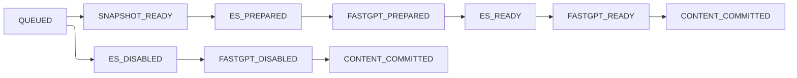

# Classics Publication Interface

## Purpose

本文档固定 Classics 发布/下线的跨模块稳定契约。流程实现、租约与恢复机制见
`docs/30-designs/CLASSICS-PUBLICATION-SPECIAL-DESIGN.md`；执行分期见
`docs/30-designs/RUNBOOK-CLASSICS-PUBLICATION-REFACTOR.md`。

## States

数据库只允许以下值：

| Field | Values |
| --- | --- |
| `contentType` | `SANCAI_ENTRY`, `WANGQI_DOCUMENT`, `MING_CUSTOMS` |
| `lifecycleStatus` | `DRAFT`, `PUBLISHED`, `OFFLINE`, `ERROR` |
| `transitionStatus` | `NONE`, `PUBLISHING`, `OFFLINING` |
| `jobType` | `PUBLISH`, `OFFLINE` |
| publish `jobStatus` | `QUEUED`, `SNAPSHOT_READY`, `ES_PREPARED`, `FASTGPT_PREPARED`, `ES_READY`, `FASTGPT_READY`, `CONTENT_COMMITTED` |
| offline `jobStatus` | `QUEUED`, `ES_DISABLED`, `FASTGPT_DISABLED`, `CONTENT_COMMITTED` |
| `jobResultStatus` | `RUNNING`, `FAILED`, `SUCCEEDED` |
| cleanup status | `NONE`, `PENDING`, `RUNNING`, `FAILED`, `SUCCEEDED` |
| ES `publicationStatus` | `PREPARING`, `READY`, `OFFLINE` |

`jobStatus` 表示最后完成的 milestone，失败点固定为 `nextStep(jobStatus)`。
`FAILED/SUCCEEDED` 不得写入 `jobStatus`。接口不定义 `CANCELLED`、`RETRYING`、
`PARTIAL_SUCCESS`、`PRIVATE` 或 `PUBLIC`。

## Admin HTTP

发布和下线沿用现有内容权限：

| Content | Publish | Offline | Batch publish | Batch offline | Permission |
| --- | --- | --- | --- | --- | --- |
| Sancai | `POST /api/classics/sancai/entries/publish` | `POST /api/classics/sancai/entries/offline` | `POST /api/classics/sancai/entries/batch/publish` | `POST /api/classics/sancai/entries/batch/offline` | `classics:sancai:edit` |
| Wangqi | `POST /api/classics/wangqi/documents/publish` | `POST /api/classics/wangqi/documents/offline` | `POST /api/classics/wangqi/documents/batch/publish` | `POST /api/classics/wangqi/documents/batch/offline` | `classics:wangqi:edit` |
| Ming Customs | `POST /api/classics/ming-customs/publish` | `POST /api/classics/ming-customs/offline` | `POST /api/classics/ming-customs/batch/publish` | `POST /api/classics/ming-customs/batch/offline` | `classics:mingcustoms:edit` |

任务查询：

| Method | Path | Permission |
| --- | --- | --- |
| POST | `/api/classics/publication-jobs/page` | `classics:publication:view` |
| POST | `/api/classics/publication-jobs/get` | `classics:publication:view` |

请求与响应：

| Type | Fields |
| --- | --- |
| single request | `id: Long` |
| batch request | `ids: List<Long>`；去重后保持请求顺序 |
| create response | `jobId`, `contentType`, `contentId`, `lifecycleStatus`, `transitionStatus` |
| batch response | `acceptedCount`, `rejectedCount`, `items[]` |
| batch item | `contentId`, `accepted`, `jobId`, `reason` |
| page request | `pageNo`, `pageSize`, optional `jobType`, `jobResultStatus`, `jobStatus`, `contentType`, `keyword` |
| get request | `id: Long` |

任务 page/detail 至少返回：`id`, `jobType`, `jobStatus`, `jobResultStatus`,
`failureStep`, `contentType`, `contentId`, `contentTitleSnapshot`,
`contentDeletedAt`, `sourceLifecycleStatus`, `targetLifecycleStatus`,
`contentVersionId`, `contentVersionNo`, `attemptCount`, `maxAttempts`,
`expiresAt`, `nextRetryAt`, `esDocumentId`, `fastgptCollectionId`,
两端 cleanup status、`failureReason`, `detailJsonSummary`, `requestedAt`,
`startedAt`, `finishedAt`。

Admin 不提供 cancel、manual retry、milestone advance、job edit 或 manual cleanup。

## Portal HTTP

Portal 只读取 ES 中 `publicationStatus = READY` 且 `deleted = false` 的文档。
候选列表、搜索和详情均执行相同过滤；MySQL 稿件状态不作为 Portal 实时查询源。
允许 ES READY 早于稿件最终回填 `PUBLISHED` 的短暂可见窗口。

## Discovery Facade

`DiscoverySearchPublicationFacade` 提供：

- `prepare`: 按稳定 `sourceId={contentType}:{contentId}` 覆盖写入，状态为 `PREPARING`。
- `ready`: 将已记录文档切换为 `READY`、`deleted=false`。
- `offline`: 将文档切换为 `OFFLINE`、`deleted=true` 并写入 `deletedAt`。
- `delete`: 物理删除文档；already missing 视为成功。
- `probe`: 返回文档是否存在、`publicationStatus`、版本和删除状态。
- Portal candidate/detail query: 只返回 READY 且未删除文档。

ES 文档不保存 Classics `lifecycleStatus`，必须包含 `contentVersionId`,
`contentVersionNo`, `publicationStatus`, `deleted`, `deletedAt`。

## FastGPT

固定服务版本为 `v4.15.1`，commit
`a0aec83f2ae444f5783416d17d0d9d12b7c1dc39`。

| Operation | Method and path | Contract |
| --- | --- | --- |
| create collection | `POST /api/core/dataset/collection/create` | `datasetId`, `name`, `type=virtual`; response data 为 collection ID |
| detail | `GET /api/core/dataset/collection/detail?id={collectionId}` | response data 含 `_id`, `forbid` |
| enable/disable | `POST /api/core/dataset/collection/update` | `id`, `forbid` |
| page data | `POST /api/core/dataset/data/v2/list` | `collectionId`, `offset`, `pageSize=30` |
| delete data | `DELETE /api/core/dataset/data/delete?id={dataId}` | empty success |
| push data | `POST /api/core/dataset/data/pushData` | 每批最多 200 条 |
| delete collection | `DELETE /api/core/dataset/collection/delete?id={collectionId}` | empty success |

一个稿件对应一个 collection，碎片对应 collection data。full replace 必须先
`forbid=true`，始终以 `offset=0,pageSize=30` 删除全部旧 data，再按固定顺序批量写入。
所有 `insertLen` 之和必须等于碎片数。READY 只由已记录 collection ID 的
`forbid=false` 证明；DISABLED 只由 `forbid=true` 证明。

`FASTGPT_PREPARED` 不根据 training status、data count 或 `forbid` 单独推断。milestone
未持久化时重试完整 full replace。create 超时且 ID 未回填时允许产生孤儿 collection。
detail probe 的 not-found 返回 missing；data/collection delete 的 already-missing
视为成功。认证、限额、参数错误、5xx、网络错误和 timeout 均为 step failure。

## Publication Payload

唯一内容输入是
`docs/20-interfaces/CLASSICS-CONTENT-VERSION-SNAPSHOT-INTERFACE.md` 定义的正式版本快照。
三类快照均不得包含 `visibility`，并包含生命周期、ACTIVE 标签和有效 QA。

ES document 与 FastGPT fragments 必须由同一 snapshot 纯函数生成：

- 保持 tags、qaPairs、images 的既定顺序；
- 不读取执行时发生变化的稿件内容；
- null 保持 null，不转换为字符串 `"null"`；
- 必需标识、标题或正文不满足校验时，`SNAPSHOT_READY` 失败；
- fragment 顺序稳定，相同 snapshot 必须产生字节级稳定 payload。

## Runtime

只允许 admin runtime 执行 publication：

- 独立 `ThreadPoolTaskExecutor`；
- step 线程预算 30 秒；
- 外部 HTTP connect timeout 3 秒、read timeout 5 秒；
- dispatch lease 30 秒，step slice lease 10 分钟，cleanup lease 5 分钟；
- 当前 step 默认最多 4 次尝试，即首次加 3 次重试；
- 重试间隔 30 秒。

Portal runtime 不分发、对账或清理任务。五个 Schedule 职责固定且不混用：

1. Dispatch：扫描可执行 RUNNING job，抢占 execution token 后提交线程。
2. Success reconcile：扫描已完成最终 milestone 但结果仍 RUNNING 的 job。
3. Failure reconcile：扫描 FAILED job 并把稿件回填 `ERROR + NONE`。
4. ES cleanup：只处理 ES cleanup。
5. FastGPT cleanup：只处理 FastGPT cleanup。

Schedule 查询、抢占条件与 terminal reconciliation 以专项设计的 SQL 语义为准。

Admin starter 默认启用 publication runtime，Portal starter 默认关闭。稳定配置项如下：

| Property | Env | Default |
| --- | --- | --- |
| `kuzhambu.classics.publication.enabled` | `KUZHAMBU_CLASSICS_PUBLICATION_ENABLED` | admin `true`, portal `false` |
| `dispatch-fixed-delay` | `KUZHAMBU_CLASSICS_PUBLICATION_DISPATCH_FIXED_DELAY` | `5s` |
| `success-reconcile-fixed-delay` | `KUZHAMBU_CLASSICS_PUBLICATION_SUCCESS_RECONCILE_FIXED_DELAY` | `30s` |
| `failure-reconcile-fixed-delay` | `KUZHAMBU_CLASSICS_PUBLICATION_FAILURE_RECONCILE_FIXED_DELAY` | `30s` |
| `es-cleanup-fixed-delay` | `KUZHAMBU_CLASSICS_PUBLICATION_ES_CLEANUP_FIXED_DELAY` | `60s` |
| `fastgpt-cleanup-fixed-delay` | `KUZHAMBU_CLASSICS_PUBLICATION_FASTGPT_CLEANUP_FIXED_DELAY` | `60s` |
| `dispatch-lease` | `KUZHAMBU_CLASSICS_PUBLICATION_DISPATCH_LEASE` | `30s` |
| `slice-lease` | `KUZHAMBU_CLASSICS_PUBLICATION_SLICE_LEASE` | `10m` |
| `cleanup-lease` | `KUZHAMBU_CLASSICS_PUBLICATION_CLEANUP_LEASE` | `5m` |
| `retry-delay` | `KUZHAMBU_CLASSICS_PUBLICATION_RETRY_DELAY` | `30s` |
| `claim-limit` | `KUZHAMBU_CLASSICS_PUBLICATION_CLAIM_LIMIT` | `20` |
| `executor-core-size` | `KUZHAMBU_CLASSICS_PUBLICATION_EXECUTOR_CORE_SIZE` | `2` |
| `executor-max-size` | `KUZHAMBU_CLASSICS_PUBLICATION_EXECUTOR_MAX_SIZE` | `4` |
| `executor-queue-capacity` | `KUZHAMBU_CLASSICS_PUBLICATION_EXECUTOR_QUEUE_CAPACITY` | `100` |
| `executor-await-termination` | `KUZHAMBU_CLASSICS_PUBLICATION_EXECUTOR_AWAIT_TERMINATION` | `30s` |
