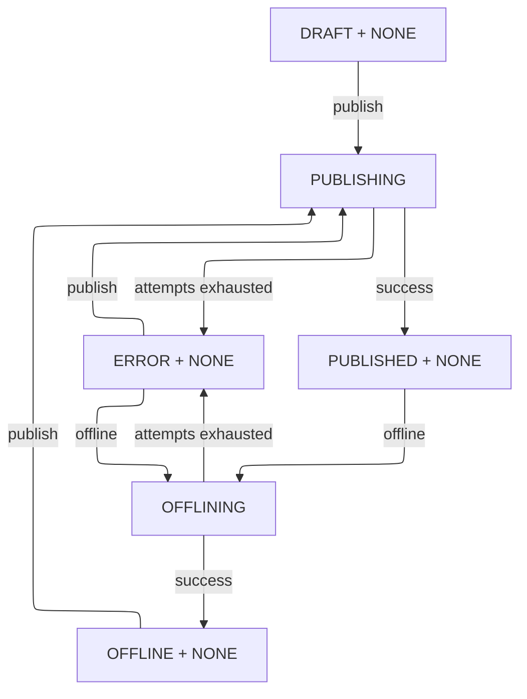
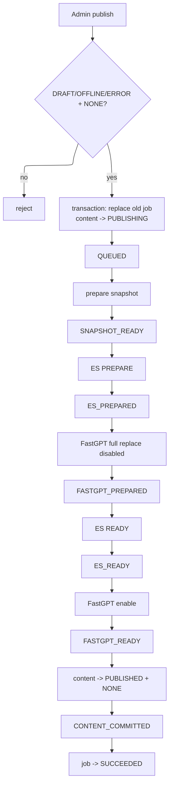
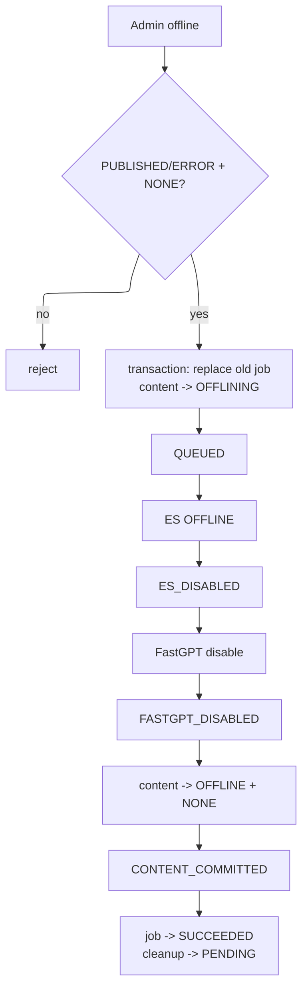
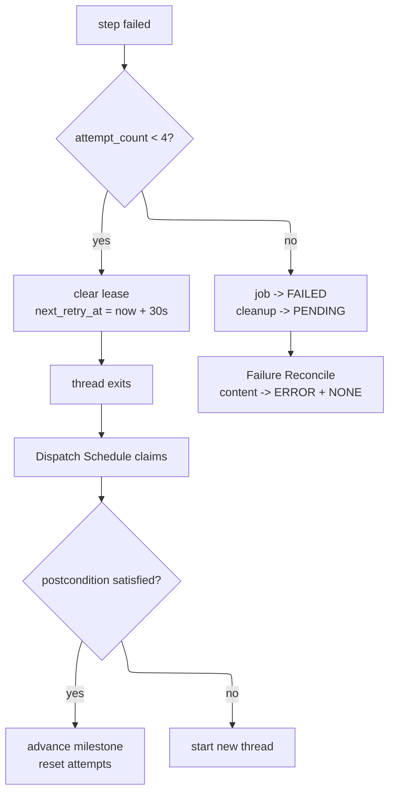
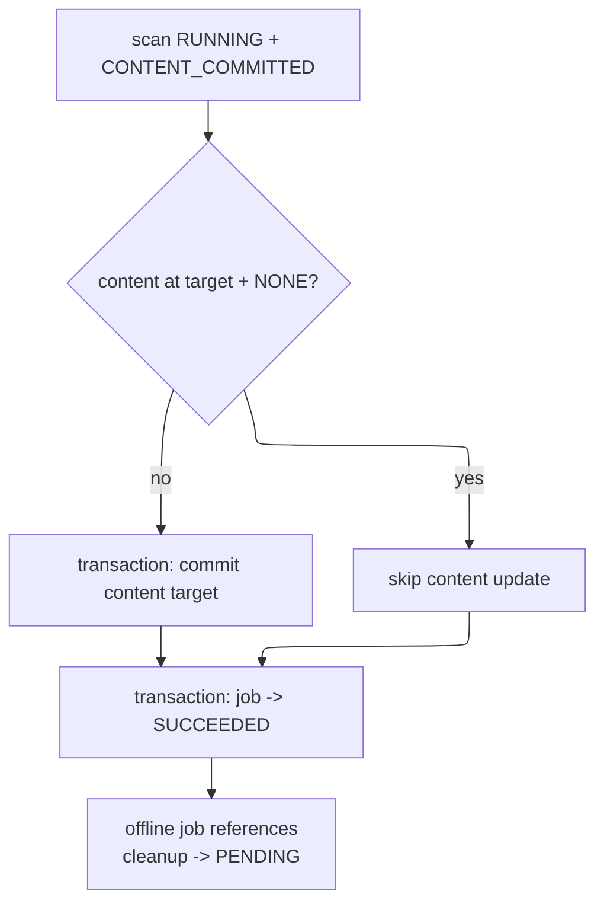
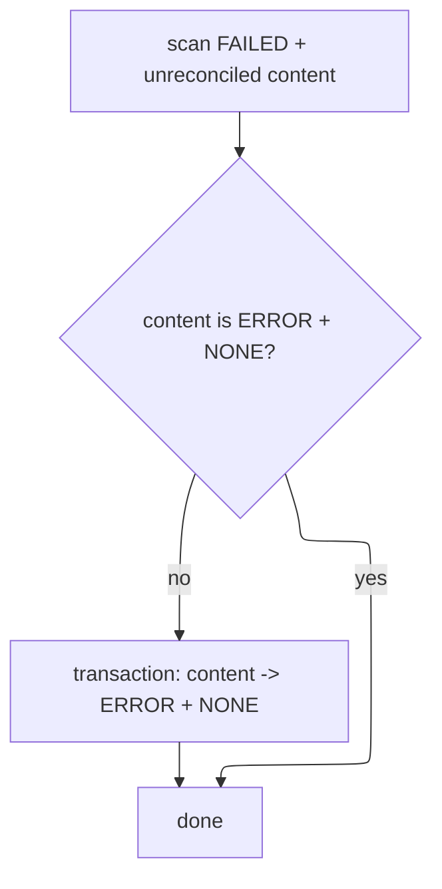
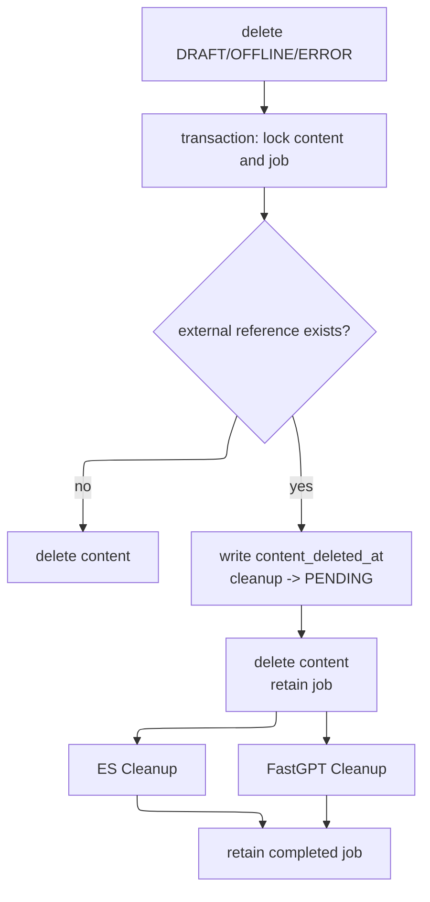
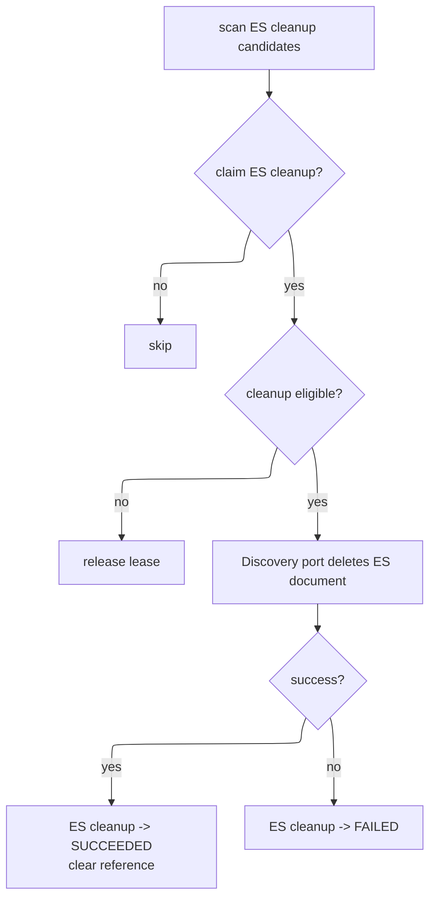
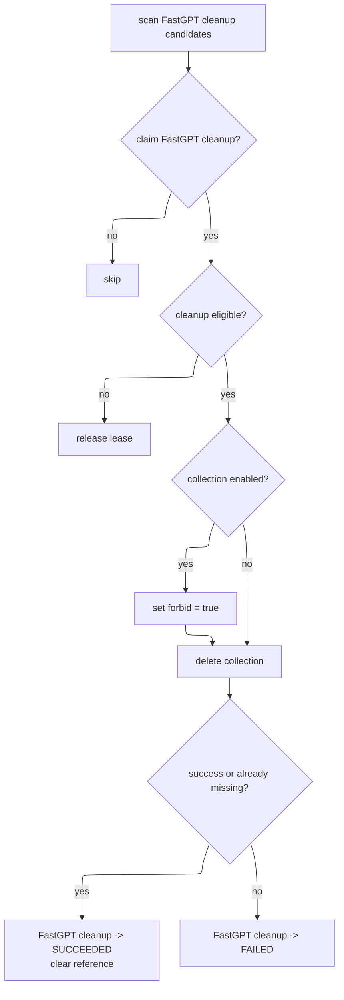

# Classics Publication Special Design

## Purpose

本文定义 Classics 稿件发布、下线、失败恢复和端侧残留清理的完整技术协议，是相关状态机和后台任务的实现依据。

发布承担内容分享能力：

- Portal 和公开搜索消费 ES 中的可查询稿件。
- FastGPT 消费已启用稿件 collection。
- 不再提供独立 private/share 链接或静态分享包。

## Scope

本文覆盖：

- 稿件生命周期和过程状态。
- 单稿件发布、下线 job。
- ES 和 FastGPT 同步。
- 线程执行、租约、自动重试和宕机接管。
- 成功与失败终态对账。
- ES 和 FastGPT 残留清理。
- 删除稿件后的清理墓碑。
- Admin 只读任务进度。

本文不覆盖：

- 发布或下线取消。
- 自动回滚端侧操作。
- 手动重试失败 job。
- 多稿件共享一个 job。
- FastGPT 内部训练、向量化和队列运维。
- 发布代次、步骤序号或下游 fencing。

## Normative Terms

| Term | Definition |
| --- | --- |
| 稿件 | `SANCAI_ENTRY`、`WANGQI_DOCUMENT` 或 `MING_CUSTOMS` 内容 |
| job | `classics_publication_job` 中单个稿件的一次 `PUBLISH` 或 `OFFLINE` 任务 |
| milestone | `job_status` 保存的最后一个成功完成状态 |
| step | `nextStep(job_status)` 返回的下一执行切片 |
| execution lease | `execution_token + expires_at` 表示的 job step 执行权 |
| cleanup lease | ES 或 FastGPT 清理状态、token 和过期时间表示的独立清理权 |
| external reference | `es_document_id` 或 `fastgpt_collection_id` |
| deletion tombstone | job 中非空的 `content_deleted_at`，证明稿件已被业务正常删除 |

本文中的“必须”“不得”是实现约束；“接受”表示当前阶段明确允许的一致性窗口或风险。

## Core Invariants

1. 稿件生命周期只有 `DRAFT`、`PUBLISHED`、`OFFLINE`、`ERROR`。
2. 稿件过程状态只有 `NONE`、`PUBLISHING`、`OFFLINING`。
3. 同一稿件最多保留一个 publication job，数据库唯一键为 `(content_type, content_id)`。
4. 一个 job 只处理一个稿件；批量操作创建多个独立 job。
5. `job_status` 只表示最后完成的 milestone；`job_result_status` 只表示整体结果。
6. `FAILED` 和 `SUCCEEDED` 只能写入 `job_result_status`，不得写入 `job_status`。
7. 发布和下线不允许取消；失败后不自动回滚。
8. 只有持有有效 `execution_token` 的线程可以推进 job。
9. 稿件处于 `PUBLISHING` 或 `OFFLINING` 时禁止业务写入。
10. Portal 和公开搜索只查询 ES `publicationStatus = READY and deleted = false`。
11. FastGPT 是否可召回只由 collection `forbid` 控制，不依赖 metadata。
12. ES 和 FastGPT 物理残留分别由独立 Schedule 清理。
13. 新 job 替换旧 job 与 Cleanup 抢占必须通过同一 job 行锁串行化。
14. 删除稿件不得级联删除仍承担清理职责的 publication job。
15. 初始化数据只允许以 `DRAFT` 写入主库；初始化稿件也必须通过 publication job 进入 `PUBLISHED`，禁止由种子 SQL 制造缺少 ES 或 FastGPT 端侧对象的已发布状态。

## Component Responsibilities

| Component | Responsibility |
| --- | --- |
| `ClassicsPublicationApplicationService` | 发起发布、发起下线、查询只读任务 |
| `ClassicsPublicationJobRepository` | publication job 持久化、条件更新和行锁 |
| `ThreadPoolTaskExecutor` | 在线程中顺序执行单个 job step |
| Discovery/Search application port | 同步执行 ES `PREPARE`、`READY`、`OFFLINE` 和物理清理 |
| Knowledge/FastGPT adapter | 管理稿件 collection、碎片 data 和 `forbid` |
| Admin 任务菜单 | 只读展示 job 结果、milestone、失败点、尝试次数和端侧信息 |

Classics 不直接写 ES，不通过 MQ 异步确认推进发布状态机。FastGPT 内部处理由 FastGPT 自有管理界面负责。

## Content Model

稿件主表必须包含：

| Field | Values | Meaning |
| --- | --- | --- |
| `lifecycle_status` | `DRAFT`, `PUBLISHED`, `OFFLINE`, `ERROR` | 最终业务生命周期 |
| `transition_status` | `NONE`, `PUBLISHING`, `OFFLINING` | 当前过程状态 |
| `current_publication_job_id` | job id or null | 当前任务归属和进度跳转指针，不作为独立锁 |

允许操作：

| Lifecycle | Transition | Edit/Delete | Publish | Offline |
| --- | --- | --- | --- | --- |
| `DRAFT` | `NONE` | allowed | allowed | rejected |
| `PUBLISHED` | `NONE` | rejected | rejected | allowed |
| `OFFLINE` | `NONE` | allowed | allowed | rejected |
| `ERROR` | `NONE` | allowed | allowed | allowed |
| any | `PUBLISHING` | rejected | rejected | rejected |
| any | `OFFLINING` | rejected | rejected | rejected |

运行中禁止编辑、删除、迁移、排序变更，以及应用会改变正式版本快照的 AI 结果。



## ES Read Model

ES 文档必须包含：

| Field | Values | Meaning |
| --- | --- | --- |
| `sourceId` | `{contentType}:{contentId}` | 稳定业务唯一键 |
| `contentType`, `contentId` | content identity | 稿件身份 |
| `contentVersionId`, `contentVersionNo` | version identity | 发布绑定的正式版本 |
| `publicationStatus` | `PREPARING`, `READY`, `OFFLINE` | ES 消费状态 |
| `deleted` | boolean | 删除态 |
| `deletedAt` | epoch ms or null | 进入删除态的时间 |

规则：

- ES 不保存 Classics `lifecycleStatus`。
- `PREPARE` 覆盖稳定 `sourceId`，写入 `PREPARING`、`deleted = false`。
- `READY` 写入 `READY`、`deleted = false`。
- `OFFLINE` 写入 `OFFLINE`、`deleted = true`、`deletedAt = now`。
- Portal 和公开搜索必须同时过滤 `publicationStatus = READY` 和 `deleted = false`。
- ES 物理删除不是发布或下线成功的前置条件。

## FastGPT Model

一个稿件对应一个 FastGPT collection，稿件碎片是该 collection 下的 data。

| Business Action | FastGPT Operation |
| --- | --- |
| disable | collection update `forbid = true` |
| enable | collection update `forbid = false` |
| full replace | disable collection，删除全部旧 data，写入完整新 data |
| cleanup | disable collection，删除 collection |

全量替换协议：

1. collection 不存在时创建空 collection，并立即设置 `forbid = true`。
2. collection 存在时先设置 `forbid = true`。
3. 按 collection 分页查询全部旧 data，并逐条删除。
4. 分批写入当前正式版本的完整碎片集。
5. FastGPT API 接受全部写入后，视为 `FASTGPT_PREPARED`。
6. 不等待或轮询 FastGPT 内部训练、向量化、`trainingAmount`。

不得仅 upsert 新碎片，不得依赖 metadata 表达发布状态，也不得依赖历史 data ID 完成全量替换。

FastGPT `v4.15.1` 删除 collection 时同时删除训练记录、data、data text 和向量数据。

## Job Model

`classics_publication_job` 是发布和下线的唯一任务表。

| Field | Meaning |
| --- | --- |
| `job_type` | `PUBLISH` 或 `OFFLINE` |
| `content_type`, `content_id` | 稿件身份 |
| `content_title_snapshot` | 稿件标题快照 |
| `content_deleted_at` | 删除墓碑；未删除为 null |
| `source_lifecycle_status` | 发起任务时的生命周期 |
| `target_lifecycle_status` | `PUBLISHED` 或 `OFFLINE` |
| `content_version_id`, `content_version_no` | 发布绑定的正式版本 |
| `job_status` | 最后完成的 milestone |
| `job_result_status` | `RUNNING`、`FAILED`、`SUCCEEDED` |
| `execution_token`, `expires_at` | step 执行租约 |
| `next_retry_at` | 下一次允许重试时间 |
| `attempt_count`, `max_attempts` | 当前 step 尝试次数；默认最大 4 次 |
| `es_document_id` | ES 文档引用 |
| `fastgpt_collection_id` | FastGPT collection 引用 |
| `fastgpt_data_ids_json` | 当前 job 新写入 data ID 的可选诊断快照，不作为清理依据 |
| `es_cleanup_status` | `NONE`、`PENDING`、`RUNNING`、`FAILED`、`SUCCEEDED` |
| `es_cleanup_token`, `es_cleanup_expires_at` | ES cleanup lease |
| `fastgpt_cleanup_status` | `NONE`、`PENDING`、`RUNNING`、`FAILED`、`SUCCEEDED` |
| `fastgpt_cleanup_token`, `fastgpt_cleanup_expires_at` | FastGPT cleanup lease |
| `failure_reason`, `detail_json` | 失败原因和端侧诊断 |
| `requested_at`, `started_at`, `finished_at` | 时间信息 |

失败点固定为 `nextStep(job_status)`。例如 `job_status = ES_PREPARED` 且 job 失败，失败点是 `FASTGPT_PREPARED`。

## Job Creation Protocol

发起发布：

- 前置条件：`lifecycle_status in (DRAFT, OFFLINE, ERROR)`。
- 前置条件：`transition_status = NONE`。
- 目标过程状态：`PUBLISHING`。

发起下线：

- 前置条件：`lifecycle_status in (PUBLISHED, ERROR)`。
- 前置条件：`transition_status = NONE`。
- 目标过程状态：`OFFLINING`。

新 job 必须在一个本地数据库事务中创建：

1. 锁定稿件。
2. 按 `(content_type, content_id)` 对旧 job 执行 `SELECT ... FOR UPDATE`。
3. 拒绝 `job_result_status = RUNNING` 的旧 job。
4. 拒绝任一 cleanup status 为 `RUNNING` 的旧 job。
5. 继承旧 job 的 `es_document_id` 和 `fastgpt_collection_id`。
6. 删除旧 job。
7. 插入新 job；data ID 为空，两个 cleanup status 为 `NONE`。
8. 更新稿件过程状态和 `current_publication_job_id`。

新任务事务和 Cleanup 条件抢占竞争同一 job 行锁：

- 新任务先持锁：Cleanup 等待，旧 job 删除后抢占失败。
- Cleanup 先持锁：新任务等待，随后读取到 `RUNNING` 并拒绝创建。

## Milestone Semantics

`job_status` 使用完成态语义：

- 它表示最后一个成功完成的 milestone。
- 执行器只执行 `nextStep(job_status)`。
- step 成功后，`job_status` 更新为该 step 对应 milestone。
- step 失败时，`job_status` 不变。
- step 尝试次数用尽时，`job_result_status` 更新为 `FAILED`。

## Publish State Machine

Milestone 序列：

```text
QUEUED
  -> SNAPSHOT_READY
  -> ES_PREPARED
  -> FASTGPT_PREPARED
  -> ES_READY
  -> FASTGPT_READY
  -> CONTENT_COMMITTED
```

| Current milestone | Step | Success postcondition | Next milestone |
| --- | --- | --- | --- |
| `QUEUED` | prepare snapshot | 正式版本及版本号已记录 | `SNAPSHOT_READY` |
| `SNAPSHOT_READY` | prepare ES | ES 为 `PREPARING`，引用已记录 | `ES_PREPARED` |
| `ES_PREPARED` | prepare FastGPT | 完整碎片集已被 API 接受，collection disabled | `FASTGPT_PREPARED` |
| `FASTGPT_PREPARED` | enable ES | ES 为 `READY`、`deleted = false` | `ES_READY` |
| `ES_READY` | enable FastGPT | collection `forbid = false` | `FASTGPT_READY` |
| `FASTGPT_READY` | commit content | 稿件为 `PUBLISHED + NONE`，current job 已清空 | `CONTENT_COMMITTED` |

`CONTENT_COMMITTED` 后由成功对账 Schedule 把 job 更新为 `SUCCEEDED`。



## Offline State Machine

Milestone 序列：

```text
QUEUED
  -> ES_DISABLED
  -> FASTGPT_DISABLED
  -> CONTENT_COMMITTED
```

| Current milestone | Step | Success postcondition | Next milestone |
| --- | --- | --- | --- |
| `QUEUED` | disable ES | ES 为 `OFFLINE`、`deleted = true` | `ES_DISABLED` |
| `ES_DISABLED` | disable FastGPT | collection `forbid = true` | `FASTGPT_DISABLED` |
| `FASTGPT_DISABLED` | commit content | 稿件为 `OFFLINE + NONE`，current job 已清空 | `CONTENT_COMMITTED` |

成功对账把 job 更新为 `SUCCEEDED` 时，有 ES/FastGPT 引用的 cleanup status 必须同时设置为 `PENDING`。物理删除不阻塞下线成功。



## Execution Lease Protocol

租约分为提交阶段和执行阶段：

| Phase | Atomic update | Attempt count |
| --- | --- | --- |
| Scheduler claim | new token, `expires_at = now + dispatchTimeout` | unchanged |
| Thread start | token match, `expires_at = now + sliceTimeout` | `+1` |
| Step success | token match, advance milestone, clear lease and retry time | reset to `0` |
| Retryable failure | token match, clear lease, set `next_retry_at` | unchanged |
| Pool rejection | token match, clear lease | unchanged |

规则：

- 线程只有在线程启动更新成功后才能调用端侧系统。
- 应用在 claim 后、线程启动前宕机，由短提交租约过期接管。
- 无执行租约时 `execution_token` 和 `expires_at` 都为 null。
- 不使用无限期或大数租约。
- 线程软截止时间为 `expires_at - 5s`。
- 发起端侧调用前，剩余租约必须大于“调用超时 + 5s”。
- ES 和 FastGPT 客户端必须配置有限连接、请求和读取超时。
- 旧线程租约过期后不得推进 job、修改结果或释放新 token。
- 当前阶段接受远端在客户端超时后继续处理造成的迟到副作用。

## Retry And Failure Protocol

- 每个 step 最多执行 4 次：1 次初始尝试和 3 次重试。
- step 失败且仍有额度时，设置 `next_retry_at = now + 30s`，线程立即退出。
- 重试必须由 Scheduler 创建新线程，不在原线程 sleep。
- Scheduler 接管时先检查 `nextStep(job_status)` 的后置条件。
- 后置条件已经成立时，直接推进 milestone 并重置尝试次数。
- 后置条件未成立时，重新执行 step。
- 尝试次数用尽时，job 更新为 `FAILED`，失败点为 `nextStep(job_status)`。
- job 进入 `FAILED` 后不得重新激活；用户只能从稿件页面创建新 job。
- job 失败时，有端侧引用的 cleanup status 设置为 `PENDING`。

失败终态分两个短事务：

1. job 更新为 `FAILED`，保留 milestone、端侧引用和失败原因。
2. 稿件更新为 `ERROR + NONE`，清空 current job。

两个事务之间宕机由失败对账 Schedule 收口。失败回填不执行实时端侧补偿，也不保证外部立即不可见。



## Terminal Reconciliation

稿件终态和 job 终态不要求在同一个事务提交。

### Success Reconcile

扫描条件：

```text
job_result_status = RUNNING
and job_status = CONTENT_COMMITTED
```

处理：

1. 稿件未达到目标生命周期时，校验 `current_publication_job_id = job.id` 后回填目标状态。
2. 稿件已经达到目标生命周期且过程状态为 `NONE` 时，把 job 更新为 `SUCCEEDED`。
3. 下线 job 同一事务把存在引用的 cleanup status 设置为 `PENDING`。
4. 失败时保留 `RUNNING + CONTENT_COMMITTED`，等待下次扫描，不消耗 step 尝试次数。



### Failure Reconcile

扫描对象：`FAILED` job 对应稿件仍指向该 job，或稿件仍处于 `PUBLISHING/OFFLINING`。

处理：

- 稿件不是 `ERROR + NONE` 时，更新为 `ERROR + NONE` 并清空 current job。
- 稿件已经是 `ERROR + NONE` 时直接完成。
- 不执行失败 step，不修改 job 为 `RUNNING`。



## Content Deletion Tombstone

`DRAFT` 且无端侧引用的稿件可以直接删除。删除可能有端侧残留的 `ERROR/OFFLINE` 稿件时，必须保留 publication job。

删除事务：

1. 锁定稿件和当前 publication job。
2. 写入 `content_title_snapshot` 和 `content_deleted_at = now`。
3. 保留稿件身份及 external references。
4. 有引用的 cleanup status 设置为 `PENDING`。
5. 删除稿件，不级联删除 job。

稿件不存在后，Cleanup 只有在 `content_deleted_at is not null` 时才能清理。两端清理完成后 job 继续作为只读记录保留；当前阶段不增加墓碑 job 删除 Schedule。



## Schedule Specification

Classics 固定使用 5 个 Schedule。每个 Schedule 只有一个职责。

| Schedule | Scan scope | Single responsibility |
| --- | --- | --- |
| `ClassicsPublicationDispatchScheduler` | 可执行、到期重试或租约过期的 `RUNNING` job，排除 `CONTENT_COMMITTED` | claim 并提交 step |
| `ClassicsPublicationSuccessReconcileScheduler` | `RUNNING + CONTENT_COMMITTED` | 收口成功终态 |
| `ClassicsPublicationFailureReconcileScheduler` | `FAILED` 且稿件未收口 | 收口失败稿件状态 |
| `ClassicsPublicationEsCleanupScheduler` | ES cleanup 为 `PENDING`、`FAILED` 或过期 `RUNNING` | 只清理 ES |
| `ClassicsPublicationFastGptCleanupScheduler` | FastGPT cleanup 为 `PENDING`、`FAILED` 或过期 `RUNNING` | 只清理 FastGPT |

建议扫描周期：

| Schedule | Period |
| --- | --- |
| Dispatch | 5s |
| Success Reconcile | 30s |
| Failure Reconcile | 30s |
| ES Cleanup | 60s |
| FastGPT Cleanup | 60s |

`next_retry_at` 决定实际重试时间，扫描周期不得替代它。

### Dispatch SQL Semantics

```text
timeout:
  job_result_status = RUNNING
  and job_status <> CONTENT_COMMITTED
  and expires_at <= now

retry:
  job_result_status = RUNNING
  and job_status <> CONTENT_COMMITTED
  and next_retry_at <= now

ready:
  job_result_status = RUNNING
  and job_status <> CONTENT_COMMITTED
  and execution_token is null
  and expires_at is null
  and next_retry_at is null
```

扫描按 `requested_at` 升序限量处理。线程池拒绝提交时立即释放提交租约，使 job 回到 ready 范围。

### Cleanup Eligibility

ES 和 FastGPT Cleanup 使用相同业务资格判断：

```text
content exists:
  lifecycle_status in (ERROR, OFFLINE)
  and transition_status = NONE
  and job is current unique job

content missing:
  job.content_deleted_at is not null
```

Cleanup 通过各自 token 和过期时间独立抢占。清理失败只更新本端 cleanup status，不修改稿件生命周期，也不修改另一端 cleanup status。

### ES Cleanup

清理对象：

- 失败发布留下的 `PREPARING` 或 `READY` 文档。
- 下线留下的 `OFFLINE/deleted` 文档。

成功后：

- `es_cleanup_status = SUCCEEDED`。
- 清空 `es_document_id` 和 ES cleanup lease。



Discovery 自有的 `DiscoverySearchRetentionScheduler` 只按 `deletedAt + retention` 清理过期删除态文档，不属于 Classics 的 5 个 Schedule。

### FastGPT Cleanup

清理对象：

- 失败发布留下的稿件 collection。
- 下线留下的稿件 collection。

处理：

1. collection 存在且 `forbid = false` 时先设置为 `true`。
2. 删除 collection。
3. 删除成功或 collection 已不存在时视为成功。

成功后：

- `fastgpt_cleanup_status = SUCCEEDED`。
- 清空 `fastgpt_collection_id` 和 FastGPT cleanup lease。



## Accepted Consistency Windows

当前阶段明确接受：

1. ES 进入 `READY` 后，Portal 可能先于主库 `PUBLISHED` 查到稿件。
2. 发布或下线失败后，外部残留可能在 Cleanup 执行前继续可见或可召回。
3. FastGPT API 接受数据不表示内部训练或向量化已经完成。
4. 客户端超时后，远端可能继续完成操作。
5. job 和稿件终态分两个事务提交，依靠 Reconcile Schedule 最终收口。

这些窗口不得被解释为自动回滚、人工重试或同步补偿要求。

## Admin Task View

任务菜单只读，不提供取消、重试或手动推进。

至少展示：

- job 类型、整体结果、最后完成 milestone 和计算出的失败点。
- 稿件类型、ID、标题快照和删除时间。
- 发起时间、开始时间、完成时间；发起人从 System 审计记录查询，不在 publication job 业务表重复保存。
- 当前租约过期时间、尝试次数和下次重试时间。
- ES 文档引用和清理状态。
- FastGPT collection 引用和清理状态。
- `failure_reason` 和 `detail_json` 摘要。

## Acceptance Criteria

- 发布成功后稿件为 `PUBLISHED + NONE`，ES 为 `READY/deleted=false`，FastGPT collection 为 `forbid=false`。
- 下线成功后稿件为 `OFFLINE + NONE`，ES 为 `OFFLINE/deleted=true`，FastGPT collection 为 `forbid=true`。
- 每个 step 初次执行及 3 次重试均失败后，job 为 `FAILED`，稿件最终收口为 `ERROR + NONE`。
- 应用重启、线程异常退出或提交窗口宕机后，Scheduler 能依据租约继续处理。
- 线程池拒绝提交不增加尝试次数。
- `ERROR` 稿件可以重新发布、下线、编辑或删除，不依赖人工处理旧 job。
- 删除 `ERROR/OFFLINE` 稿件后，两个 Cleanup Schedule 仍能凭墓碑清理端侧残留。
- 新 job 替换旧 job 与 Cleanup 抢占不会并发操作同一旧 job。
- Portal 和公开搜索不会查询 `PREPARING`、`OFFLINE` 或 `deleted=true` 文档。
- FastGPT 发布状态不依赖 metadata，也不等待 FastGPT 内部训练完成。
- Classics 固定只有 5 个 publication Schedule，且每个 Schedule 只承担一个目标。
