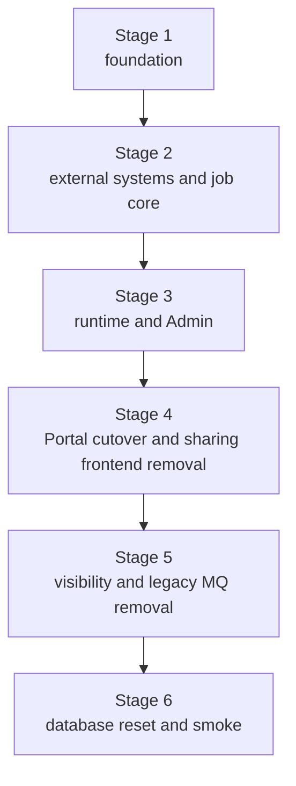

# Classics Publication Refactor Runbook

## Purpose

本文是 Classics 稿件发布与下线改造的临时执行手册。

目标是把现有 private/share、`visibility` 和基于 RocketMQ 的搜索同步，改造为由 `classics_publication_job` 驱动的异步发布与下线状态机。

完成后：

- 稿件只使用 `lifecycle_status + transition_status` 表达最终生命周期和发布过程。
- 发布和下线由单稿件 job、线程切片、执行租约和 5 个单责 Schedule 推进。
- ES 使用 `publicationStatus` 表达 `PREPARING`、`READY` 和 `OFFLINE`。
- FastGPT 使用稿件级 collection 的 `forbid` 表达 disable/enable。
- Portal 和公开搜索只消费 ES 中 `publicationStatus = READY and deleted = false` 的稿件。
- Admin 提供发布、下线和只读任务页面，不提供取消或手动重试。
- 旧分享链接、私有分享、分享管理、分享表和分享 API 全部移除。

行为真相源：

- [CLASSICS-REQUIREMENTS.md](../10-requirements/CLASSICS-REQUIREMENTS.md)
- [CLASSICS-PUBLICATION-SPECIAL-DESIGN.md](./CLASSICS-PUBLICATION-SPECIAL-DESIGN.md)
- [CLASSICS-DESIGN.md](./CLASSICS-DESIGN.md)
- [CLASSICS-CONTENT-VERSION-SNAPSHOT-INTERFACE.md](../20-interfaces/CLASSICS-CONTENT-VERSION-SNAPSHOT-INTERFACE.md)

本文只规定 stage、实施顺序、代码落点、验证和收口，不修改专项设计中的状态机语义。

## Scope

本次闭环包含：

- Classics 三类稿件的生命周期、过程状态和 publication job 映射。
- 发布与下线 application service、step executor、租约、重试和 5 个 Schedule。
- Discovery 的 ES 发布写入、探测、删除和公开查询过滤。
- `kuzhambu-common-knowledge` 的 FastGPT collection/data 管理能力。
- 三类稿件的写入保护和删除墓碑。
- Admin 发布/下线 API、批量发起 API、任务查询 API 和页面。
- Portal 已发布稿件列表、详情和公开搜索的 ES 可见性。
- private/share 后端、前端、配置、权限和测试清理。
- Classics -> RocketMQ -> Discovery 旧搜索同步链路清理。
- 当前目标 schema 的数据库重建校准。
- 最终阶段的端到端冒烟、故障冒烟和重启接管冒烟。
- 与行为变化直接相关的接口、设计、环境样例和 readiness 证据。

主要工程范围：

```text
db/
kuzhambu-servers/common/kuzhambu-common-knowledge/
kuzhambu-servers/biz/classics/
kuzhambu-servers/biz/discovery/
kuzhambu-servers/starter/kuzhambu-admin-starter/
kuzhambu-servers/starter/kuzhambu-portal-starter/
kuzhambu-apps/admin-web/
kuzhambu-apps/portal-web/
docs/20-interfaces/
docs/30-designs/
docs/40-readiness/
```

## Non-goals

本次不实现：

- 发布或下线取消。
- FAILED job 的人工重试、人工推进或重新激活。
- 端侧操作自动回滚。
- 多稿件共享一个 job。
- MQ 异步确认发布步骤。
- 发布代次、步骤序号、下游 fencing 或复杂迟到写保护。
- FastGPT 内部训练、向量化或队列状态轮询。
- 基于 metadata 的 FastGPT 发布状态。
- 同步等待 ES 或 FastGPT 物理删除后再完成下线。
- 墓碑 job 的定时删除。
- 旧数据库在线迁移、灰度兼容或不停机 schema 演进。
- 在中间 stage 部署或运行完整业务冒烟。
- 与发布无关的 Classics、Discovery 或 Knowledge 重构。

## Stage Rules

1. 每次只执行一个 stage。
2. 每个 stage 目标修改 20-80 个文件。因跨模块删除或契约切换超过 80 个时，在 stage
   开始前记录实际基线、原因和 work package 文件预算；不得仅为满足数字拆出不可编译的 stage。
3. commit 边界遵循仓库治理规则：一个 commit 表达一个可独立理解、可验证的工程判断。
   建议文件数只作为内聚性异常信号，不得为了满足数字拆出不完整判断。
4. 每个 stage 必须从干净工作区开始，并以干净工作区结束。
5. 每个 stage 必须独立通过声明的格式化、编译和测试。
6. 中间 stage 不要求数据库运行时兼容，也不执行业务冒烟；最终 Stage 6 统一重建数据库并冒烟。
7. 不得以“后续 stage 会修复”为理由结束不可编译或测试失败的 stage。
8. 过渡代码只能存在于当前 stage 的中间 commit；stage 结束时必须满足该 stage 的残留约束。
9. Java 修改先执行最窄 `spotless:apply`，再执行 `spotless:check` 和 `checkstyle:check`。
10. 前端修改先执行目标 workspace format，再执行 `format:check` 和 `lint`。
11. job、Schedule 和 cleanup 必须以数据库条件更新结果作为执行权依据。
12. `dev.env` 不提交；新增环境变量同步 `.env.example` 和 `deploy/.env.example`。
13. 自动化故障测试遵守 `Prepare / Execute / Assert / Restore`。
14. 每个 stage 使用独立 PR，并以普通 merge commit 合入 `main`，保留可审核的阶段内
    commit 历史；除非用户明确要求，不使用 squash。

## Stage Delivery Protocol

每个 stage 按以下交付，不把六个 stage 堆在一个 PR：

1. Stage 1 是初始化例外：前置设计、数据库校准和本 RUNBOOK 已在
   `feature/classics-publication-workflow`，因此 Stage 1 直接在该分支实施，并与前置文档
   形成同一个可验证 PR。Stage 2-6 只在前一 stage 的 PR 已普通 merge 后，从新的
   `origin/main` 创建分支。
2. 分支和 PR 标题固定使用下表，不临场取名：

| Stage | Branch | PR title |
| --- | --- | --- |
| 1 | `feature/classics-publication-workflow` | `Feat(classics): 完成发布改造 Stage 1 基础能力` |
| 2 | `feature/classics-publication-stage-2-job-core` | `Feat(classics): 完成发布改造 Stage 2 任务核心` |
| 3 | `feature/classics-publication-stage-3-runtime-admin` | `Feat(classics): 完成发布改造 Stage 3 运行时与管理端` |
| 4 | `feature/classics-publication-stage-4-portal-cutover` | `Feat(classics): 完成发布改造 Stage 4 Portal 切换` |
| 5 | `feature/classics-publication-stage-5-legacy-cleanup` | `Refactor(classics): 完成发布改造 Stage 5 遗留清理` |
| 6 | `feature/classics-publication-stage-6-smoke-close` | `Test(classics): 完成发布改造 Stage 6 冒烟收口` |

3. stage 内按可独立理解、可验证的工程判断创建 commit；文件数只作为内聚性检查信号。
   commit 标题继续使用 `Type(scope): 中文说明`。
4. stage 全部门禁通过后先提交全部功能和 readiness evidence，但 RUNBOOK 仍保持
   `ACTIVE`，不要填写不存在的 PR number。
5. 报告分支、commit 范围和验证结果；获得用户明确指令后 push 分支并按上表创建 PR。
6. 取得 PR number 后，把当前 stage 压缩为 `COMPLETE` 摘要，填写 `Delivery PR` 和内部
   commit 范围，提交并 push 该文档收口 commit。
7. PR 描述完整填写 `.github/pull_request_template.md`，不使用 `WIP`，并等待
   `.github/workflows/pr-verify.yml` 全部通过和 review。失败时继续在同一 stage
   分支修复，禁止开始下一 stage。
8. 经用户明确允许合并后执行：

```sh
gh pr merge <PR_NUMBER> --merge --delete-branch
```

9. 合并后执行：

```sh
git switch main
git pull --ff-only origin main
git status --short
```

10. `git status --short` 必须为空；在本地执行记录中保存 PR number、功能 commit 范围和
    main 上的 merge commit，然后才能创建下一 stage 分支。已合并 RUNBOOK 摘要只要求
    保留 PR number 和功能 commit 范围，不为回填 merge SHA 额外创建文档 PR。

Merge 规则：

- 使用普通 merge commit，完整保留 stage 内小步 commit 历史；
- 一个 PR 只交付一个 stage，不把多个 stage 合并成一个交付边界；
- PR discussion、checks、小步 commit 和 merge commit 共同作为审查证据；
- 禁止 squash merge、rebase merge 或直接 push main；
- Agent 不得自行 push、创建 PR 或合并，仍需用户明确指令。

## Executor Protocol

执行模型必须按以下顺序操作，不得跳步：

1. 读取 `docs/AGENTS.md`、本 RUNBOOK、四份行为真相源和当前 stage 涉及的治理文档。
2. 确认前一个 stage 为 `COMPLETE`；把当前 stage 状态改为 `ACTIVE`。
3. 运行 `git status --short`。工作区不干净时先识别现有改动，禁止覆盖或回滚用户改动。
4. 运行当前 baseline scans，记录实际命中数和预计修改文件。
5. 按 work package 顺序实施。一个 work package 未通过聚焦测试时不得开始下一个。
6. 每次编辑前说明将修改的文件边界；编辑后先运行最窄 formatter 和聚焦测试。
7. 每完成一个工程判断，检查 `git diff --check` 和 `git diff --stat`；确认改动可独立理解、
   可验证且没有混入无关内容后创建 commit。
8. stage 内允许中间 commit 只完成部分能力，但每个 commit 必须可解释，不得是随机保存点。
9. 完成所有 work package 后运行 stage 的完整 Java/前端门禁。
10. 门禁失败时修复当前 stage，不得把失败项推迟到下一 stage。
11. 把命令、退出码、关键断言和偏差写入 readiness evidence。
12. 提交功能和 readiness evidence，保持 stage 为 `ACTIVE` 并确认工作区干净。
13. 按 Stage Delivery Protocol 等待授权创建 PR；取得 PR number 后再压缩为 `COMPLETE`
    并提交文档收口。未获用户指令时停在干净分支，报告待执行的 git/PR 动作。

禁止执行模型：

- 只完成第一个 work package 就宣布 stage 完成；
- 用新增兼容字段保留已经明确废弃的 private/share 语义；
- 为通过测试删除关键断言、禁用测试或扩大异常捕获；
- 在没有 affected-row 所有权判断时调用外部系统；
- 直接修改 dev 数据库代替 schema、seed 或代码改造；
- 在 Stage 6 之前运行数据库重建或业务冒烟；
- 自动 push、创建 PR 或合并，除非用户另行明确要求。

每个 Java stage 的公共退出门禁：

```sh
cd kuzhambu-servers
mvn spotless:check
mvn checkstyle:check
mvn test
```

允许先运行聚焦测试缩短反馈，但 stage 结束前必须运行完整 Java reactor test，确保下游 starter 和跨域模块仍可编译。

每个前端 stage 的公共退出门禁：

```sh
cd kuzhambu-apps
pnpm run format:check
pnpm run lint
pnpm run test
pnpm run build
```

只改一个前端时可以先运行 `pnpm --filter ...`，stage 结束前仍运行完整 workspace 门禁。

## Stage Maintenance

RUNBOOK 执行期间保留：

- 已完成 stage 的压缩摘要；
- 当前 stage 的完整工作包和退出条件；
- 后续 stage 的范围、依赖和验收点。

完成 stage 后：

1. 先把验证结果和偏差写入 `docs/40-readiness/`。
2. 删除已完成 stage 的 checklist、实现提示和重复命令。
3. 把该 stage 压缩为不超过 10 行的摘要。
4. 摘要记录交付 PR、内部功能 commit 范围、实际文件数、验证命令、结果和遗留项。
5. 功能 commit 范围不包含压缩 RUNBOOK 的收口 commit。
6. 没有遗留项时写 `Deferred: none`。
7. 不保留已经完成的待办文本。

压缩格式：

```markdown
### Stage N: Name

Status: COMPLETE

- Functional commits: `first..last`
- Delivery PR: `#123` (`merge`)
- Files: 42
- Verification: `mvn test`; `pnpm run test`
- Result: 一句话说明已经建立的稳定能力
- Deferred: none
```

stage 状态：

| Status | Meaning |
| --- | --- |
| `PENDING` | 尚未开始 |
| `ACTIVE` | 当前唯一执行 stage |
| `COMPLETE` | 已完成并压缩 |
| `BLOCKED` | 存在阻塞，不启动依赖 stage |

## Current Baseline

执行前重新运行以下扫描并记录文件数：

```sh
rg -l "ClassicsSharing|ClassicsShare|classics_share|private-shares|share-links" \
  kuzhambu-servers | wc -l

rg -l "private-shares|share-list|share-detail|SharingPage|classics-share" \
  kuzhambu-apps | wc -l

rg -l "ClassicsSearchIndexSync|RocketMqDiscoverySearchIndexSync|SearchIndexSyncEvent" \
  kuzhambu-servers | wc -l

rg -l "\bvisibility\b|Visibility|visibilityScopes" \
  kuzhambu-servers/biz/classics \
  kuzhambu-servers/biz/discovery \
  kuzhambu-apps/admin-web/src/pages/classics \
  kuzhambu-apps/portal-web/src/pages | wc -l
```

编写本文时的测量值：

| Area | Files |
| --- | ---: |
| sharing server | 72 |
| sharing admin-web | 11 |
| sharing portal-web | 14 |
| legacy Classics search MQ | 18 |
| non-sharing Classics server visibility | 91 |
| non-sharing Discovery visibility | 32 |
| non-sharing Admin Classics visibility | 38 |
| non-sharing Portal visibility | 11 |

这些数值用于 stage 分界，不是删除目标。每个匹配必须确认语义；资产安全分析中的 visibility 不属于发布可见性。

## Target Placement

### Classics

```text
kuzhambu-classics-domain/
  domain/publication/model/entity/
  domain/publication/model/enums/
  domain/publication/model/valueobject/
  domain/publication/repository/

kuzhambu-classics-application/
  application/publication/command/
  application/publication/query/
  application/publication/result/
  application/publication/service/
  application/publication/service/impl/
  application/publication/support/
  application/publication/scheduler/
  application/publication/configure/

kuzhambu-classics-infra/
  infra/publication/persistence/dataobject/
  infra/publication/persistence/mapper/
  infra/publication/persistence/assembler/
  infra/publication/repository/impl/

kuzhambu-classics-interface/
  interfaces/admin/publication/controller/
  interfaces/admin/publication/controller/request/
  interfaces/admin/publication/controller/response/
  interfaces/admin/publication/assembler/
```

`ClassicsPublicationApplicationService` 只发起任务和查询任务。step executor 执行一个切片；5 个 Schedule 只扫描、抢占并调用对应入口。

### Discovery

在 `kuzhambu-discovery-facade` 增加一个面向外域的 `DiscoverySearchPublicationFacade`，提供：

- ES PREPARE；
- ES READY；
- ES OFFLINE；
- ES physical delete；
- publication status/version probe；
- Portal READY candidate 和 detail visibility query。

实现放在 Discovery application。ES 细节继续由 `SearchIndexGateway` 和 `ElasticsearchSearchIndexGateway` 承担。Classics application 依赖 Discovery facade，不直接依赖 Discovery application、infra 或 ES client。

### FastGPT

扩展 `kuzhambu-common-knowledge`：

- 创建 disabled collection；
- 读取 collection 和 `forbid`；
- 更新 `forbid`；
- 分页列出 collection data；
- 逐条删除 data；
- 分批写入 data；
- 删除 collection。

Classics application 使用发布语义 gateway 包装通用客户端。状态机不得拼装 FastGPT HTTP 路径，也不得通过 metadata 判断发布状态。

FastGPT 服务版本固定为 tag `v4.15.1`、commit
`a0aec83f2ae444f5783416d17d0d9d12b7c1dc39`。本 RUNBOOK 中的 HTTP
契约已按该版本源代码校验；不得根据最新版在线文档替换 method、path 或 payload。

| Operation | Method and path | Required input/result |
| --- | --- | --- |
| create empty collection | `POST /api/core/dataset/collection/create` | body `datasetId`, `name`, `type=virtual`; response data 是 collection ID |
| read collection | `GET /api/core/dataset/collection/detail?id={collectionId}` | response data 包含 `_id`, `forbid` |
| set enabled/disabled | `POST /api/core/dataset/collection/update` | body `id`, `forbid` |
| page data | `POST /api/core/dataset/data/v2/list` | body `collectionId`, `offset`, `pageSize=30`; response data 包含 `total`, `list[]._id` |
| delete one data | `DELETE /api/core/dataset/data/delete?id={dataId}` | empty success response |
| insert data batch | `POST /api/core/dataset/data/pushData` | body `collectionId`, `data[]`; each batch at most 200 |
| delete collection | `DELETE /api/core/dataset/collection/delete?id={collectionId}` | empty success response |

实现前必须再次对照上述 commit 中的 OpenAPI schema 和 dev FastGPT 实例做一个只读
`detail` probe。若 dev 实例不兼容，停止 Stage 2，记录实际版本并先修订接口文档和
RUNBOOK；不得偷偷兼容两个版本。现有 `FastGptKnowledgeBaseClient` 的 legacy
`POST collection/delete` 不是本次新能力的依据，Stage 2 必须按固定契约改正并更新测试。

FastGPT 错误归一化规则：

- create、update、push 的任意非成功响应均为 step failure；
- detail、data delete 和 collection delete 的明确 not-found 响应可按调用语义归一化；
- probe 遇到 collection not-found 返回 `missing`，不能伪造 `forbid`；
- data/collection delete 遇到 already-missing 视为成功；
- 认证、限额、参数错误、5xx、网络错误和 timeout 不得归一化为 already-missing；
- API 返回成功只表示请求已接受，不读取 training status。

全量删除 data 时始终查询 `offset=0, pageSize=30`，删除当前页全部 ID 后再次查询
offset 0，直到 list 为空。边删除边递增 offset 会跳过记录，禁止这样实现。`pushData`
按 fragment 顺序每 200 条一批，所有 response 的 `insertLen` 之和必须等于 fragment
总数；不相等即 step failure。任一 delete/push 失败都不推进 milestone，下一次重试从
disable collection 和全量删除重新开始。

### Runtime

- 5 个 publication Schedule 只由 admin runtime 执行。
- publication 使用独立 `ThreadPoolTaskExecutor`。
- portal runtime 不分发 job、不对账、不清理端侧。

### Module Dependencies

| Stage | Module | Change |
| --- | --- | --- |
| 2 | `kuzhambu-classics-application` | add `kuzhambu-discovery-facade` |
| 2 | `kuzhambu-classics-application` | add `kuzhambu-common-knowledge` for the publication adapter |
| 2 | `kuzhambu-discovery-application` | keep existing `kuzhambu-classics-facade`; do not depend on Classics application |
| 4 | `kuzhambu-classics-interface` | remove `kuzhambu-common-rocketmq` only after all Classics publishers are deleted |
| 4 | `kuzhambu-discovery-interface` | remove `kuzhambu-common-rocketmq` only if no non-Classics consumer remains |

不要通过 `kuzhambu-knowledge-facade` 暴露 FastGPT HTTP 细节。`kuzhambu-common-knowledge` 是通用技术客户端，Classics application 在本域 adapter 中把它转换为 publication 语义。

## Fixed Implementation Contract

执行者不得在实现阶段重新发明以下契约。若现有代码导致契约无法实现，先更新本 RUNBOOK 和对应稳定文档，再继续编码。

### Enum Values

只允许以下数据库值：

| Field | Values |
| --- | --- |
| `content_type` | `SANCAI_ENTRY`, `WANGQI_DOCUMENT`, `MING_CUSTOMS` |
| `lifecycle_status` | `DRAFT`, `PUBLISHED`, `OFFLINE`, `ERROR` |
| `transition_status` | `NONE`, `PUBLISHING`, `OFFLINING` |
| `job_type` | `PUBLISH`, `OFFLINE` |
| publish `job_status` | `QUEUED`, `SNAPSHOT_READY`, `ES_PREPARED`, `FASTGPT_PREPARED`, `ES_READY`, `FASTGPT_READY`, `CONTENT_COMMITTED` |
| offline `job_status` | `QUEUED`, `ES_DISABLED`, `FASTGPT_DISABLED`, `CONTENT_COMMITTED` |
| `job_result_status` | `RUNNING`, `FAILED`, `SUCCEEDED` |
| cleanup status | `NONE`, `PENDING`, `RUNNING`, `FAILED`, `SUCCEEDED` |
| ES `publicationStatus` | `PREPARING`, `READY`, `OFFLINE` |

禁止：

- 把 `FAILED/SUCCEEDED` 写入 `job_status`；
- 把 `PUBLISHING/OFFLINING` 写入 `lifecycle_status`；
- 新增 `PRIVATE/PUBLIC`、`CANCELLED`、`RETRYING` 或 `PARTIAL_SUCCESS` 状态；
- 用 null 代替 `NONE`。

### Admin HTTP

项目现有 Admin API 基路径使用 `/api/classics/...`，不新增 `/api/admin/...` 前缀。

发布和下线动作放入三类稿件现有 controller，以复用已有内容权限：

| Content | Single publish | Single offline | Batch publish | Batch offline | Permission |
| --- | --- | --- | --- | --- | --- |
| Sancai | `/api/classics/sancai/entries/publish` | `/api/classics/sancai/entries/offline` | `/api/classics/sancai/entries/batch/publish` | `/api/classics/sancai/entries/batch/offline` | `classics:sancai:edit` |
| Wangqi | `/api/classics/wangqi/documents/publish` | `/api/classics/wangqi/documents/offline` | `/api/classics/wangqi/documents/batch/publish` | `/api/classics/wangqi/documents/batch/offline` | `classics:wangqi:edit` |
| Ming Customs | `/api/classics/ming-customs/publish` | `/api/classics/ming-customs/offline` | `/api/classics/ming-customs/batch/publish` | `/api/classics/ming-customs/batch/offline` | `classics:mingcustoms:edit` |

任务查询使用独立只读 controller：

| Method | Path | Permission | Purpose |
| --- | --- | --- | --- |
| POST | `/api/classics/publication-jobs/page` | `classics:publication:view` | 分页查询 |
| POST | `/api/classics/publication-jobs/get` | `classics:publication:view` | 任务详情 |

请求响应固定为：

| Type | Required fields |
| --- | --- |
| single request | `id: Long` |
| batch request | `ids: List<Long>`，去重后按请求顺序逐条处理 |
| create response | `jobId`, `contentType`, `contentId`, `lifecycleStatus`, `transitionStatus` |
| batch response | `acceptedCount`, `rejectedCount`, `items[]` |
| batch item | `contentId`, `accepted`, `jobId`, `reason` |
| page request | `pageNo`, `pageSize`, optional `jobType`, `jobResultStatus`, `jobStatus`, `contentType`, `keyword` |
| get request | `id: Long` |

job page/detail response 至少包含：

```text
id
jobType
jobStatus
jobResultStatus
failureStep
contentType
contentId
contentTitleSnapshot
contentDeletedAt
sourceLifecycleStatus
targetLifecycleStatus
contentVersionId
contentVersionNo
attemptCount
maxAttempts
expiresAt
nextRetryAt
esDocumentId
esCleanupStatus
fastgptCollectionId
fastgptCleanupStatus
failureReason
detailJsonSummary
requestedAt
startedAt
finishedAt
```

HTTP 边界规则：

- controller 只做 permission、request validation、assembler 和 application service 调用。
- 前端 ID 使用 `string`；HTTP JSON 进入后端后由现有 codec 转为强类型 ID。
- invalid lifecycle、active transition、RUNNING old job 和 RUNNING cleanup 返回业务冲突，不返回成功空对象。
- batch 单项冲突只写对应 item，不回滚其他 item。
- 任务查询不返回完整 snapshot、FastGPT data 内容或 secret。

### Portal HTTP

保留现有公开路由和主要 response shape，不新建 share 替代路由：

```text
/api/portal/classics/sancai/categories/list
/api/portal/classics/sancai/volumes/list
/api/portal/classics/sancai/entries/page
/api/portal/classics/sancai/entries/get
/api/portal/classics/sancai/images/{entryId}/{imageId}/content
/api/portal/discovery/search/**
```

切换规则：

- category/volume overview 只能聚合 ES READY candidate，不得统计主库全部条目。
- entry page 先从 Discovery facade 分页取得 READY IDs，再按返回顺序 hydration。
- entry detail 先验证同一 `contentType + contentId` 在 ES READY/not deleted。
- image/resource 直链也必须验证父稿件 ES READY，不能只校验 image ID。
- ES READY hit 但主库 hydration 缺失时返回 not found，不回退到主库公开查询。
- 不在 portal response 中保留 `visibility`、share token 或 private access 字段。

### Runtime Defaults

配置前缀固定为 `kuzhambu.classics.publication`：

| Property | Default | Environment variable |
| --- | ---: | --- |
| `enabled` | admin `true`, portal `false` | `KUZHAMBU_CLASSICS_PUBLICATION_ENABLED` |
| `dispatch-fixed-delay` | `5s` | `KUZHAMBU_CLASSICS_PUBLICATION_DISPATCH_FIXED_DELAY` |
| `success-reconcile-fixed-delay` | `30s` | `KUZHAMBU_CLASSICS_PUBLICATION_SUCCESS_RECONCILE_FIXED_DELAY` |
| `failure-reconcile-fixed-delay` | `30s` | `KUZHAMBU_CLASSICS_PUBLICATION_FAILURE_RECONCILE_FIXED_DELAY` |
| `es-cleanup-fixed-delay` | `60s` | `KUZHAMBU_CLASSICS_PUBLICATION_ES_CLEANUP_FIXED_DELAY` |
| `fastgpt-cleanup-fixed-delay` | `60s` | `KUZHAMBU_CLASSICS_PUBLICATION_FASTGPT_CLEANUP_FIXED_DELAY` |
| `dispatch-lease` | `30s` | `KUZHAMBU_CLASSICS_PUBLICATION_DISPATCH_LEASE` |
| `slice-lease` | `10m` | `KUZHAMBU_CLASSICS_PUBLICATION_SLICE_LEASE` |
| `cleanup-lease` | `5m` | `KUZHAMBU_CLASSICS_PUBLICATION_CLEANUP_LEASE` |
| `retry-delay` | `30s` | `KUZHAMBU_CLASSICS_PUBLICATION_RETRY_DELAY` |
| `claim-limit` | `20` | `KUZHAMBU_CLASSICS_PUBLICATION_CLAIM_LIMIT` |
| `executor-core-size` | `2` | `KUZHAMBU_CLASSICS_PUBLICATION_EXECUTOR_CORE_SIZE` |
| `executor-max-size` | `4` | `KUZHAMBU_CLASSICS_PUBLICATION_EXECUTOR_MAX_SIZE` |
| `executor-queue-capacity` | `100` | `KUZHAMBU_CLASSICS_PUBLICATION_EXECUTOR_QUEUE_CAPACITY` |
| `executor-await-termination` | `30s` | `KUZHAMBU_CLASSICS_PUBLICATION_EXECUTOR_AWAIT_TERMINATION` |

FastGPT 单次 HTTP 调用继续使用有限的 `KUZHAMBU_KNOWLEDGE_FASTGPT_TIMEOUT`，默认 `10s`。不得把 HTTP timeout 改成无限或与 10 分钟 slice lease 等长。

publication executor bean 固定为：

```text
bean name: classicsPublicationTaskExecutor
thread name prefix: classics-publication-
core/max/queue: use ClassicsPublicationProperties
rejection: ThreadPoolExecutor.AbortPolicy
waitForTasksToCompleteOnShutdown: true
awaitTerminationSeconds: executor-await-termination
```

禁止使用 `CallerRunsPolicy`，否则 Scheduler 线程会直接执行远端切片，pool rejection
释放租约协议也不会触发。提交必须捕获 `TaskRejectedException`，按同一 execution token
清除 dispatch token/expiry；affected rows 为 0 时直接结束。

Stage 1 必须把该表写入接口文档；Stage 3 必须实现并同步：

- `ClassicsPublicationProperties`；
- admin/portal `application.yml`；
- `.env.example`；
- `deploy/.env.example`；
- properties binding/default tests。

### Milestone Steps

| Job type | Current milestone | Execute exactly one action | Required postcondition | Next milestone |
| --- | --- | --- | --- | --- |
| PUBLISH | `QUEUED` | 读取或生成当前正式版本并绑定 job | job 有 version ID/no | `SNAPSHOT_READY` |
| PUBLISH | `SNAPSHOT_READY` | ES full overwrite | `PREPARING`, `deleted=false`, version matches | `ES_PREPARED` |
| PUBLISH | `ES_PREPARED` | FastGPT full replace while disabled | collection ID 已记录，全部 API 接受，仍 `forbid=true` | `FASTGPT_PREPARED` |
| PUBLISH | `FASTGPT_PREPARED` | ES READY | `READY`, `deleted=false`, version matches | `ES_READY` |
| PUBLISH | `ES_READY` | FastGPT enable | collection `forbid=false` | `FASTGPT_READY` |
| PUBLISH | `FASTGPT_READY` | 回填稿件 | `PUBLISHED + NONE`, current job null | `CONTENT_COMMITTED` |
| OFFLINE | `QUEUED` | ES OFFLINE | `OFFLINE`, `deleted=true` | `ES_DISABLED` |
| OFFLINE | `ES_DISABLED` | FastGPT disable | collection missing or `forbid=true` | `FASTGPT_DISABLED` |
| OFFLINE | `FASTGPT_DISABLED` | 回填稿件 | `OFFLINE + NONE`, current job null | `CONTENT_COMMITTED` |

执行规则：

- `job_status` 是最后完成 milestone；executor 只执行表中下一行动作。
- milestone 更新必须匹配 `jobId + executionToken + expectedJobStatus + RUNNING`。
- 外部调用返回后 token 已失效时，不更新本地状态。
- `FASTGPT_PREPARED` 未持久化时总是重做 full replace，不按 data count 猜测完成。
- ES/FastGPT postcondition 已成立时可以直接推进 milestone。
- `CONTENT_COMMITTED` 由 Success Reconcile 转为 `SUCCEEDED`，不由 Dispatch 直接写 SUCCEEDED。

### Publication Payload

发布 payload 的唯一输入是 job 绑定的
`classics_content_version.snapshot_json`。不得在后续 step 重新读取稿件正文、标签、问答或
当前版本号。`SNAPSHOT_READY` 必须完成：

1. 在稿件锁内读取 current formal version；不存在时按现有正式版本协议生成一次。
2. 把 `content_version_id` 和 `content_version_no` 写入 job。
3. 校验 version row 的 `contentType + contentId + versionNo` 与 job 一致，再用
   `ClassicsContentSnapshotAssembler` 反序列化并校验 snapshot 内的
   `contentType + contentId`。
4. 后续每次重试按 job 的 version ID 重新读取相同 `snapshot_json`。

Stage 1 必须校准
`CLASSICS-CONTENT-VERSION-SNAPSHOT-INTERFACE.md` 和三类 snapshot record：

- 移除 `visibility`；
- 三类 snapshot 都包含 `lifecycleStatus`、按 `priority ASC, id ASC` 排序的 active
  `tags[]` 和完整 `qaPairs[]`；
- `SANCAI_ENTRY` snapshot 增加 `volumeTitle`, `categoryId`, `categoryTitle`，并与已有
  `volumeId` 一起在生成正式版本时固化；发布 step 不再从当前 category/volume 表补齐 ES；
- tag 只保留 `status = ACTIVE`，问答只保留 question、answer 都非空的记录；
- snapshot 字段调整、文档示例、assembler round-trip test 和 seed JSON 必须同 commit
  保持一致。

新增 `ClassicsPublicationPayloadAssembler`，对同一 snapshot 必须生成字节级稳定的 ES
document 和有序 FastGPT fragments。禁止使用随机 ID、当前时间、HashMap 遍历顺序或
当前主库补充内容。

ES document 至少包含：

```text
sourceId = contentType + ":" + contentId
contentType
contentId
contentVersionId
contentVersionNo
title
summary
categoryId/categoryName when present in snapshot
volumeId/volumeTitle when present in snapshot
ordered textSegments
ordered tagNames
publicationStatus
deleted
deletedAt
contentUpdatedAt
```

`publicationStatus/deleted/deletedAt` 由 ES step 注入；其余字段全部来自绑定 snapshot 和
job version identity。`textSegments` 顺序固定：

| Content | Ordered non-blank fields |
| --- | --- |
| `SANCAI_ENTRY` | `title`, `categoryTitle`, `volumeTitle`, `originalText`, `translationText`, `summary`, each QA `question`, `answer` |
| `WANGQI_DOCUMENT` | `title`, `summary`, `content`, each QA `question`, `answer` |
| `MING_CUSTOMS` | `title`, `category`, `chapter`, `section`, `summary`, `content`, `originalExcerpts`, each QA `question`, `answer` |

FastGPT 一个稿件只对应一个 `virtual` collection。fragment 使用 FastGPT
`pushData.data[]` 的 `q/a/chunkIndex`：

| Fragment | `q` | `a` |
| --- | --- | --- |
| main, `chunkIndex=0` | title | 按上述 content 顺序拼接除 title 外的有值字段，每段格式 `字段名：值`，换行分隔；末尾追加 `标签：tag1、tag2` |
| QA, `chunkIndex=1..n` | question | answer |

main fragment 不重复 title，QA 不并入 main。空字段跳过，字符串 trim，保留正文内部换行；
tag 去空、按 snapshot 顺序去重。title 为空或 main 与 QA 都无法形成 fragment 时，
`SNAPSHOT_READY` 失败，不调用 ES/FastGPT。`pushData` 每批最多 200 条，按
`chunkIndex` 连续切批；不得自行按字符数二次切分，FastGPT 内部训练和切分不属于发布状态机。

collection 名称固定为：

```text
{contentType}:{contentId}:{sanitizedTitle}
```

`sanitizedTitle` 是 trim 后标题，移除 CR/LF，最长 80 个 Unicode code point；为空时使用
`untitled`。collection ID 一经 job 记录后重试必须复用。只有 create timeout 且 ID
尚未回填时允许再次创建，遗留 collection 交给人工可见的 FastGPT 管理界面或后续垃圾治理，
不增加本阶段嗅探。

### Failure Diagnostics

固定业务冲突 reason：

```text
CONTENT_NOT_FOUND
INVALID_LIFECYCLE
TRANSITION_ACTIVE
ACTIVE_JOB_EXISTS
CLEANUP_ACTIVE
FORMAL_VERSION_MISSING
SNAPSHOT_INVALID
```

`failure_step` 是 `nextStep(jobType, jobStatus)` 的结果；任务创建前冲突只返回 reason，
不创建 FAILED job。执行失败时：

- `failure_reason` 保存不超过 1024 字符的单行摘要；
- `detail_json` 只保存 `failedStep`, `attempt`, `exceptionClass`, `provider`,
  `httpStatus`, `providerCode`, `timeout`, `occurredAt` 和不含 secret 的计数/ID；
- HTTP response body、API key、完整 snapshot、完整 fragment 和 stack trace 不写数据库；
- 每次失败覆盖当前 step 的诊断；step 成功时清空 failure fields；
- terminal failure 保留最后一次诊断，Admin 只返回脱敏后的 `detailJsonSummary`。

### Repository Atomic Operations

repository/mapper 至少提供以下语义。方法名可以按本地命名规则微调，但条件不得减少：

| Operation | Required where condition | Required update |
| --- | --- | --- |
| lock old job | `content_type + content_id` | `SELECT ... FOR UPDATE` |
| dispatch claim | `id + RUNNING + executable scope + lease available` | new token, dispatch expiry |
| thread start | `id + same token + RUNNING` | slice expiry, attempt `+1`, set started time if null |
| milestone success | `id + same token + RUNNING + expected milestone` | next milestone, clear token/expiry/retry, attempt `0`, refs/detail |
| retry release | `id + same token + RUNNING` | clear token/expiry, next retry time, failure detail |
| terminal failure | `id + same token + RUNNING + attempt >= max` | result FAILED, clear token/expiry/retry, cleanup PENDING when refs exist, finished/failure |
| ES cleanup claim | eligible ES status and lease | ES cleanup RUNNING/token/expiry |
| FastGPT cleanup claim | eligible FastGPT status and lease | FastGPT cleanup RUNNING/token/expiry |
| cleanup success | same cleanup token | cleanup SUCCEEDED, clear ref and lease |
| cleanup failure | same cleanup token | cleanup FAILED, clear lease, retain ref/reason |

每个条件更新必须断言 affected rows：

- `1`：当前线程取得或仍持有执行权；
- `0`：立即退出，不调用后续外部操作，不释放其他 token。

事务边界固定为：

1. job creation 在一个本地事务内完成稿件锁、旧 job 锁、旧 job 删除、新 job 插入和稿件 transition 更新。
2. Scheduler claim 和 thread start 分别使用短本地事务。
3. 不得在数据库事务或 `SELECT ... FOR UPDATE` 持锁期间调用 ES/FastGPT。
4. 外部调用前先提交 thread-start 租约；外部调用后使用新短事务按 token 条件更新。
5. terminal failure 先提交 job FAILED，再由 Failure Reconcile 独立事务回填稿件 ERROR。
6. CONTENT_COMMITTED 后由 Success Reconcile 独立收口 job SUCCEEDED。
7. cleanup claim、外部删除和 cleanup result 分成 claim transaction、无事务远端调用、result transaction。

事务实现不得依赖同一个 Spring bean 内部 `this.method()` 调用 `@Transactional` 方法；
这不会经过代理。使用独立 transaction service bean 或显式 `TransactionTemplate` 实现上述
短事务，step orchestrator 只编排。测试必须证明远端 gateway 调用时
`TransactionSynchronizationManager.isActualTransactionActive()` 为 false。

### Cleanup Eligibility

| Content state | Job relation | Cleanup |
| --- | --- | --- |
| content exists as `ERROR/OFFLINE + NONE` | `content_type + content_id` 唯一 job 行仍是被 claim 的 job | allowed |
| content exists in any other state | any | rejected and lease released |
| content missing | `content_deleted_at != null` | allowed |
| content missing | no tombstone | rejected and lease released |

ES 和 FastGPT cleanup 分别抢占自己的 token，不共用 `execution_token`。

“唯一 job 行”由 `uk_classics_publication_job_content` 保证，不是要求
`content.current_publication_job_id = job.id`。成功/失败 reconcile 都会清空稿件指针，
cleanup 必须仍可执行。每次 cleanup 在远端调用前用短事务锁定
稿件行，再锁定 `content_type + content_id` 的 job 行并复核：

```text
claimed job still exists
and no replacement job has been inserted
and content is ERROR/OFFLINE + NONE or tombstoned
```

新 publish/offline 创建事务与 cleanup qualification 使用相同的 content/job row-lock
顺序。谁先取得锁谁完成本地决策；新 job 创建发现 RUNNING cleanup 时拒绝，cleanup 发现 job
已被替换时不得调用远端。不得以已清空的稿件 current-job 指针阻止合法清理。

### Schedule Queries

| Schedule | Exact scan scope | Must not do |
| --- | --- | --- |
| Dispatch | RUNNING, not CONTENT_COMMITTED, and ready/retry-due/lease-expired | reconcile terminal state or cleanup |
| Success Reconcile | RUNNING + CONTENT_COMMITTED | execute external step |
| Failure Reconcile | FAILED and content still points to job or remains transitioning | reactivate job or call external system |
| ES Cleanup | ES cleanup PENDING/FAILED/expired RUNNING | modify FastGPT cleanup or content lifecycle |
| FastGPT Cleanup | FastGPT cleanup PENDING/FAILED/expired RUNNING | modify ES cleanup or content lifecycle |

Dispatch candidate predicates：

```text
ready:
  execution_token is null
  and expires_at is null
  and next_retry_at is null

retry due:
  next_retry_at <= now

lease expired:
  expires_at <= now
```

共同条件：

```text
job_result_status = RUNNING
and job_status <> CONTENT_COMMITTED
```

所有扫描按 `requested_at ASC, id ASC`，最多读取 `claim-limit` 条。扫描结果不是执行权；每条记录必须再次执行 atomic claim。

attempt 语义：

- Scheduler claim 不增加。
- pool rejection 不增加。
- thread start 成功增加。
- step success 重置为 `0`。
- step failure且 `< maxAttempts` 保留 attempt，写 retry time。
- 第 `4` 次 thread start 失败后写 FAILED。

## Stage Map



| Stage | Status | Expected files | Gate |
| --- | --- | ---: | --- |
| 1. Foundation | `COMPLETE` | 100-170 | contracts/static checks and full Java checks |
| 2. External systems and job core | `COMPLETE` | 80-150 | full Java checks |
| 3. Runtime and Admin | `PENDING` | 100-180 | full Java and admin-web checks |
| 4. Portal cutover and sharing frontend removal | `PENDING` | 50-100 | full Java/frontend checks and sharing residue scans |
| 5. Publication visibility and legacy MQ removal | `PENDING` | 90-170 | full Java/frontend checks and legacy residue scans |
| 6. Database reset and smoke | `PENDING` | 20-60 | full checks plus runtime smoke |

文件数是基于当前扫描的估计，不是硬上限。每个 stage 内按 work package 和可独立理解、
可验证的工程判断推进；stage 结束时只设置一个独立编译、测试检查点。

## Stage File Manifest

以下是必查路径，不是允许忽略 `rg` 新命中的白名单。

### Stage 1

Delete:

```text
kuzhambu-servers/biz/classics/**/sharing/**
kuzhambu-servers/biz/classics/**/*Sharing*
kuzhambu-servers/biz/classics/**/*Share*
```

Add or modify:

```text
docs/20-interfaces/CLASSICS-PUBLICATION-INTERFACE.md
kuzhambu-servers/biz/classics/kuzhambu-classics-domain/**/publication/**
kuzhambu-servers/biz/classics/kuzhambu-classics-infra/**/publication/**
kuzhambu-servers/biz/classics/**/sancai/**
kuzhambu-servers/biz/classics/**/wangqi/**
kuzhambu-servers/biz/classics/**/mingcustoms/**
kuzhambu-servers/biz/classics/**/pom.xml
```

Required tests:

```text
ClassicsPublicationJob*Test
ClassicsPublicationRepository*Test
Classics*PersistenceMappingTest
```

### Stage 2

Add or modify:

```text
kuzhambu-servers/biz/discovery/kuzhambu-discovery-facade/**
kuzhambu-servers/biz/discovery/kuzhambu-discovery-application/**/search/**
kuzhambu-servers/biz/discovery/kuzhambu-discovery-infra/**/ElasticsearchSearchIndexGateway*
kuzhambu-servers/biz/discovery/kuzhambu-discovery-infra/**/DiscoverySearchDocument*
kuzhambu-servers/common/kuzhambu-common-knowledge/**
kuzhambu-servers/biz/classics/kuzhambu-classics-application/**/publication/**
kuzhambu-servers/biz/classics/**/pom.xml
```

Required tests:

```text
DiscoverySearchPublicationFacade*Test
ElasticsearchSearchIndexGateway*Test
FastGptKnowledgeBaseClientTest
ClassicsPublicationStateMachineTest
ClassicsPublicationStepExecutorTest
ClassicsPublicationApplicationService*Test
```

### Stage 3

Add or modify:

```text
kuzhambu-servers/biz/classics/kuzhambu-classics-application/**/publication/scheduler/**
kuzhambu-servers/biz/classics/kuzhambu-classics-application/**/publication/configure/**
kuzhambu-servers/biz/classics/kuzhambu-classics-interface/**/publication/**
kuzhambu-servers/biz/classics/**/sancai/**
kuzhambu-servers/biz/classics/**/wangqi/**
kuzhambu-servers/biz/classics/**/mingcustoms/**
kuzhambu-servers/starter/kuzhambu-admin-starter/**
kuzhambu-servers/starter/kuzhambu-portal-starter/**
kuzhambu-apps/admin-web/src/pages/classics/publication-jobs/**
kuzhambu-apps/admin-web/src/pages/classics/sancai/**
kuzhambu-apps/admin-web/src/pages/classics/wangqi/**
kuzhambu-apps/admin-web/src/pages/classics/ming-customs/**
kuzhambu-apps/admin-web/src/router/**
.env.example
deploy/.env.example
```

Required tests:

```text
ClassicsPublicationDispatchSchedulerTest
ClassicsPublicationSuccessReconcileSchedulerTest
ClassicsPublicationFailureReconcileSchedulerTest
ClassicsPublicationEsCleanupSchedulerTest
ClassicsPublicationFastGptCleanupSchedulerTest
ClassicsPublicationWriteGuardTest
ClassicsPublicationAdminControllerTest
publication-jobs page/service tests
admin starter scheduling ownership test
portal starter scheduling exclusion test
```

### Stage 4

Delete or modify:

```text
kuzhambu-apps/admin-web/src/pages/classics/sharing/**
kuzhambu-apps/admin-web/src/pages/classics/common/classics-share-*
kuzhambu-apps/portal-web/src/pages/share-list/**
kuzhambu-apps/portal-web/src/pages/share-detail/**
kuzhambu-servers/biz/classics/kuzhambu-classics-application/**/portal/**
kuzhambu-servers/biz/classics/kuzhambu-classics-interface/**/portal/**
kuzhambu-servers/biz/discovery/**/search/**
kuzhambu-apps/portal-web/src/pages/classics/**
kuzhambu-apps/portal-web/src/pages/discovery/**
```

Required tests:

```text
Discovery public READY filter tests
Classics Portal list/detail visibility tests
portal-web Classics list/detail tests
portal-web Discovery search tests
admin/portal route tests
```

### Stage 5

Delete or modify:

```text
kuzhambu-servers/biz/classics/**/searchsync/**
kuzhambu-servers/biz/discovery/**/*RocketMqDiscoverySearchIndexSync*
kuzhambu-servers/biz/classics/**/*Visibility*
kuzhambu-servers/biz/classics/**/sancai/**
kuzhambu-servers/biz/classics/**/wangqi/**
kuzhambu-servers/biz/classics/**/mingcustoms/**
kuzhambu-apps/admin-web/src/pages/classics/**
kuzhambu-apps/portal-web/src/pages/classics/**
kuzhambu-apps/portal-web/src/pages/discovery/**
```

Required tests:

```text
Sancai/Wangqi/Ming visibility-removal tests
Discovery publicationStatus-only contract tests
ordinary-save no-external-sync tests
zero-result legacy architecture tests
```

### Stage 6

Add or modify before RUNBOOK deletion:

```text
docs/40-readiness/CLASSICS-PUBLICATION-EVIDENCE.md
kuzhambu-servers/starter/kuzhambu-admin-starter/src/test/**/ClassicsPublicationRuntimeSmokeIT.java
```

Stage 6 不新增生产故障开关，不提交 `dev.env`、数据库 dump、完整日志或临时截图。

## Plan

### Stage 1: Foundation

Status: COMPLETE

- Functional commits: `722855678^..a885a4fbb`
- Delivery PR: `#193` (`merge`)
- Files: 138
- Verification: full 58-module Java gate; publication persistence focused tests; sharing,
  MQ and visibility residue scans; PR-wide frontend, workers, governance and database checks
- Result: 发布契约、正式 snapshot、服务端 sharing 拆除、publication domain/job persistence
  和三类稿件状态持久化已经形成可独立验证的 Stage 1 基础。
- Deferred: frontend sharing removal (Stage 4), Portal publication cutover (Stage 4),
  legacy MQ and remaining visibility cleanup (Stage 5), database reset and runtime smoke (Stage 6).

### Stage 2: External systems and job core

Status: COMPLETE

- Branch: `feature/classics-publication-stage-2-job-core`
- Base: `origin/main` at `d6af806b0`
- Functional commits: `d862d7a1f^..05c7e8a52`
- Delivery PR: `#194`
- Result:
  - Discovery 提供 `PREPARING/READY/OFFLINE` 全量覆盖、物理删除和探测能力，
    `_id` 固定为 `contentType:contentId`。
  - FastGPT client 支持 virtual collection、`forbid` enable/disable、分页清空、
    200 条分批写入、探测和删除；Classics gateway 始终执行 collection 全量替换。
  - `ClassicsPublicationContent` 是发布领域使用的稿件实体视图；job 创建事务完成
    稿件优先行锁、状态校验、旧 job 替换、外部引用继承和 transition 回填。
    batch 逐稿件使用独立事务，page/detail 可按结果状态和当前步骤定位失败点。
  - snapshot bind 在同一本地事务内完成正式版本、稿件 version marker、payload
    校验和 milestone；payload 的 `searchDocument` 是 ES 写入对象。
  - FastGPT 新 collection ID 在清空和写入前写回 job，切片失败后重试复用该引用；
    ES 字段、标签去重和 FastGPT fragment 顺序确定。
  - 纯状态机和单切片 executor 已覆盖发布、下线及最终稿件状态回填；远端调用
    不持有本地事务，milestone 使用 execution token 条件推进。
- Verification:
  - `mvn spotless:check`
  - `mvn checkstyle:check`
  - `mvn test`
  - 58-module Java reactor passed；ES、FastGPT、job creation、payload、state
    machine、step executor 和 persistence focused tests passed。
- Deferred: Portal/public READY filter, runtime lease and 5 Schedules, write guard,
  Admin API/UI (Stage 3-4); legacy MQ and visibility removal (Stage 5); runtime smoke
  and RUNBOOK deletion (Stage 6).

### Stage 3: Runtime and Admin

Status: COMPLETE

该 stage 让 job 可以由线程池和 5 个 Schedule 自动收口，并完成写保护、Admin API 和 Admin UI。

#### Work Package 3A: Build leases and 5 Schedules

Actions:

- [x] 增加固定 bean name/prefix、`AbortPolicy` 和 shutdown 语义的 bounded
  `ThreadPoolTaskExecutor`。
- [x] Scheduler claim 写短 dispatch lease，不增加 attempt。
- [x] Thread start token match 后写 slice lease，并增加 attempt。
- [x] 每次远端调用前检查 `expires_at - 5s`。
- [x] 可重试失败清租约，写 `next_retry_at = now + 30s`，线程退出。
- [x] 第 4 次失败写 FAILED 和 cleanup PENDING。
- [x] pool rejection 清 dispatch lease，不增加 attempt。
- [x] 实现且仅实现 5 个 Schedule：
  `ClassicsPublicationDispatchScheduler`、
  `ClassicsPublicationSuccessReconcileScheduler`、
  `ClassicsPublicationFailureReconcileScheduler`、
  `ClassicsPublicationEsCleanupScheduler`、
  `ClassicsPublicationFastGptCleanupScheduler`。
- [x] admin runtime 独占 5 个 Schedule。
- [x] 增加 job/content ref、milestone、attempt 和 elapsed structured log。

Tests 使用 controllable clock，覆盖：

- ready/retry/expired lease；
- unexpired foreign token；
- pool rejection；
- CallerRunsPolicy zero-use architecture assertion；
- external gateway invocation has no active local transaction；
- claim 后 thread start 前重启等价恢复；
- remote success 后 milestone 前中断等价恢复；
- `RUNNING + CONTENT_COMMITTED`；
- FAILED content reconcile；
- cleanup PENDING/FAILED/expired RUNNING。

Exit:

- 每个 milestone 最多 4 次 thread start。
- retry 只能由新 Scheduler submission 触发。
- CONTENT_COMMITTED 不进入 dispatch。
- success/failure reconcile 可恢复分事务中断。
- ES/FastGPT cleanup 互不修改。
- starter context test 证明 portal runtime 不执行这些 Schedule。
- 完整 Java formatter/static/test 门禁通过。

Commit split:

1. Executor/configuration。
2. Dispatch claim/scheduler。
3. Retry/final failure。
4. Success reconcile。
5. Failure reconcile。
6. ES cleanup。
7. FastGPT cleanup。
8. Starter ownership/config samples。

#### Work Package 3B: Enforce write guards and add Admin API

Write guards:

- [x] 增加共享 state guard。
- [x] 覆盖 edit、delete、内容迁移、sort、tag/QA、version restore 和 AI result apply。
- [x] PUBLISHING/OFFLINING 拒绝全部业务写。
- [x] PUBLISHED 拒绝 edit/delete。
- [x] DRAFT/OFFLINE/ERROR + NONE 按设计允许对应操作。
- [x] 删除 ERROR/OFFLINE 且有外部引用时写 tombstone 和 cleanup PENDING。
- [x] 稿件删除不级联删除 publication job。
- [x] missing content 只有 `content_deleted_at != null` 才允许 cleanup。

Admin API:

- [x] 提供本文规定的 4 个 Sancai entries publish/offline endpoint。
- [x] 提供本文规定的 4 个 Wangqi documents publish/offline endpoint。
- [x] 提供本文规定的 4 个 Ming customs publish/offline endpoint。
- [x] 增加只读 `ClassicsPublicationAdminController` 的 job page/get endpoint。
- [x] 三类稿件响应返回 lifecycle、transition 和 current job ID。
- [x] 返回 invalid lifecycle、active transition、active job 和 active cleanup 的明确 conflict。
- [x] 三类动作复用各自 `*:edit` 权限；job page/get 使用 `classics:publication:view`。
- [x] 用 `@SysLogger` 记录 publish/offline 发起动作，通过 System audit 查询发起人。
- [x] 不增加 cancel/retry/edit/advance/cleanup endpoint。

实现说明：为保持 interface model 的子域隔离，三类稿件共 12 个动作 endpoint 集中在
`ClassicsPublicationActionController`；路径、请求/响应、权限和审计契约保持不变。

Exit:

- service-level operation matrix 全覆盖。
- tombstone cleanup eligibility tests 通过。
- controller contract tests 与 Stage 1 接口一致。
- 完整 Java formatter/static/test 门禁通过。

Commit split:

1. Shared guard/matrix tests。
2. Sancai guard integration。
3. Wangqi guard integration。
4. Ming guard integration。
5. Tombstone deletion。
6. Admin publication controller。
7. Manuscript state response。

#### Work Package 3C: Build Admin publication UI

Actions:

- [x] 新增 `src/pages/classics/publication-jobs/`。
- [x] 注册 `/classics/publication-jobs`，移除 router 对 `SharingPage` 的依赖。
- [x] 实现只读 job table/detail。
- [x] 展示 result、milestone、failure step、attempt、retry time、lease、external refs、cleanup 和 failure summary。
- [x] 不显示 cancel、retry、edit、advance 或 cleanup 控件。
- [x] 三类稿件页面增加 publish/offline action 和 lifecycle/transition tag。
- [x] transition active 时禁用所有写入控件。
- [x] batch 显示 accepted/rejected 和逐条原因。
- [x] ERROR 显示外部残留最终一致性提示。
- [x] 增加 service contract、page tests 和 E2E。

Exit:

- menu URL、router 和 page 一致。
- UI action matrix 与 server 一致。
- job 页面严格只读。
- 完整 Java门禁和前端 workspace 门禁通过。

Commit split:

1. Job page service/types。
2. Job page table/detail。
3. Sancai actions。
4. Wangqi actions。
5. Ming actions。
6. Batch/error UI。
7. Frontend tests/E2E。

Stage 3 exit:

- 5 个 Schedule 可自动推进、重试、对账和清理。
- 三类稿件写保护、Admin API 和 Admin UI 完整可用。
- job 页面严格只读。
- 完整 Java和前端 workspace 门禁通过。
- 工作区干净，Stage 3 已拆为多个小 commit。

Result:

- bounded executor、dispatch/reconcile/cleanup runtime 和 5 个 Schedule 已完成，且由
  admin starter 独占；lease、attempt、重试、拒绝和分事务恢复路径均有自动化覆盖。
- 三类稿件共享 publication state guard、删除 tombstone、动作 API、状态响应和冲突
  契约已完成；publication job API 与页面保持只读。
- Admin 三类稿件页面已接入单条/批量发布下线、状态标签、过渡态写保护、逐条拒绝原因
  和外部残留提示。

Verification:

- `mvn spotless:check`
- `mvn checkstyle:check`
- `mvn test`（58-module reactor；Surefire reports 均为 0 failure / 0 error）
- `pnpm run format:check`
- `pnpm run lint`
- `pnpm run build`
- `pnpm run test`（admin 90 files / 385 tests；portal 25 files / 79 tests）
- Playwright E2E spec 可被 `playwright --list` 发现；本机缺少 Chromium binary，未执行浏览器用例。

Deferred: Portal/public READY cutover (Stage 4); legacy MQ and remaining visibility
cleanup (Stage 5); database reset, real ES/FastGPT runtime smoke and RUNBOOK deletion
(Stage 6).

### Stage 4: Portal cutover and sharing frontend removal

Status: PENDING

该 stage 把 Portal/公开搜索切换到 ES READY，并清除 sharing frontend。三类稿件
visibility 和旧 RocketMQ 搜索同步保留到 Stage 5；本 stage 结束时系统必须独立编译和测试。

#### Work Package 4A: Cut Portal to ES READY

Actions:

- [ ] Discovery public query 固定过滤 `publicationStatus = READY and deleted = false`。
- [ ] Classics Portal list/search 从 Discovery facade 获取 candidate IDs。
- [ ] detail 必须先由 Discovery 确认 ES READY/not deleted。
- [ ] ES 可见后再由 Classics application hydration category、volume、image、asset 和正式 snapshot。
- [ ] Portal 不按主库 lifecycle 二次判断候选可见性。
- [ ] 保留 ES READY 早于主库 PUBLISHED 的已接受窗口。
- [ ] 更新 public search、Classics Portal 和 portal-web tests。

Tests:

- ES PREPARING + main PUBLISHED：隐藏。
- ES READY + main `DRAFT + PUBLISHING`：可见。
- ES OFFLINE/deleted + main PUBLISHED：隐藏。
- direct detail 非 READY：隐藏。
- ES hit 后主库详情缺失：安全 not found。

Exit:

- Portal candidate visibility 只由 ES 决定。
- detail hydration 不能绕过 READY。
- 完整 Java门禁和前端 workspace 门禁通过。

Commit split:

1. READY query filter。
2. Portal visibility facade。
3. Classics Portal list/detail。
4. portal-web integration。
5. Visibility tests。

#### Work Package 4B: Remove sharing frontend

Actions:

- [ ] 删除 admin `pages/classics/sharing`。
- [ ] 删除 admin `pages/classics/common/classics-share-*`。
- [ ] 删除 portal `share-list` 和 `share-detail`。
- [ ] 删除 private-share HTTP exception。
- [ ] 删除 sharing routes、tests、CSS 和 E2E。
- [ ] 删除前端 sharing permission/menu fallback。

Zero-result scans:

```sh
rg -n "SharingPage|classics-share|private-shares|share-list|share-detail" \
  kuzhambu-apps

rg -n "ClassicsSharing|ClassicsShare|classics_share|share-links" \
  kuzhambu-servers kuzhambu-apps db
```

两条扫描都必须零命中。历史设计说明位于 `docs/`，不在本扫描范围；任何 live code、
route、menu、permission、test fixture 或 schema 命中都必须在本 stage 清除。

Exit:

- 前端没有 share token、private share 或 SharingPage。
- `/classics/publication-jobs` 是唯一对应菜单页面。
- 完整前端 workspace 门禁通过。

Commit split:

1. Admin sharing page/common deletion。
2. Portal share-list deletion。
3. Portal share-detail deletion。
4. Routes/http/tests residue。

Stage 4 exit:

- Portal/public search candidate visibility 只由 ES READY/not deleted 决定。
- sharing backend 和 frontend 全部移除。
- 三类稿件旧 visibility 和旧 MQ 仍可存在，但不得参与 Portal 可见性决策。
- 完整 Java和前端 workspace 门禁通过。
- Stage 4 residue scans 已逐项审阅。
- 工作区干净，Stage 4 已拆为多个小 commit。

### Stage 5: Publication visibility and legacy MQ removal

Status: PENDING

Entry:

- Stage 4 为 COMPLETE。
- Portal 和公开搜索已经只使用 ES READY/not deleted。
- sharing backend/frontend 已无 live code。
- 工作区干净，Java和前端完整门禁已通过。

该 stage 删除三类稿件剩余 publication visibility，并拆除 Classics -> RocketMQ ->
Discovery 旧搜索同步。可以删除 Portal response/type 中的旧 visibility 字段，但不得改变
Stage 4 已固定的 ES READY/not deleted 候选入口，不得重新引入主库可见性 fallback。

#### Work Package 5A: Remove Sancai publication visibility

Actions:

- [ ] 删除 Sancai domain/application/infra/interface 的 publication `visibility`。
- [ ] 删除 repository query/update visibility。
- [ ] 删除 Admin Sancai visibility filter、column、form 和 batch-private/public actions。
- [ ] 删除 Portal Sancai visibility fields。
- [ ] 更新 Sancai tests、fixtures 和 E2E。
- [ ] 保留资产审核中的 `visibilityRiskStatus`。

Exit:

- Sancai 发布可见性只由 lifecycle/transition/job 表达。
- Sancai 不再读取 schema 中不存在的 visibility column。
- 完整 Java门禁和前端 workspace 门禁通过。

Commit split:

1. Sancai domain/application。
2. Sancai infra。
3. Sancai interface。
4. Admin Sancai。
5. Portal Sancai。
6. Tests/E2E。

#### Work Package 5B: Remove Wangqi and Ming publication visibility

Actions:

- [ ] 删除 Wangqi publication `visibility` 全栈字段、query 和 mutation。
- [ ] 删除 Ming Customs publication `visibility` 全栈字段、query 和 mutation。
- [ ] 删除 shared Classics content 中仅服务 visibility 的 contract/support。
- [ ] 删除 Admin Wangqi/Ming visibility filter、column、form 和 batch actions。
- [ ] 更新 timeline、version、tag cloud 和 content tests。

Exit:

- 三类稿件均不读取 visibility column。
- Admin 三类页面不再展示 PRIVATE/PUBLIC。
- 完整 Java门禁和前端 workspace 门禁通过。

Commit split:

1. Wangqi server。
2. Wangqi Admin。
3. Ming server。
4. Ming Admin。
5. Shared content contract。
6. Tests/E2E。

#### Work Package 5C: Remove Discovery visibility and legacy MQ

Actions:

- [ ] 删除 Discovery public search 的 `visibilityScopes` 和旧 `contentStatuses`。
- [ ] 删除 ES document 中仅服务旧发布模型的 `visibility/contentStatus`。
- [ ] 删除 QA/FastGPT 同步中基于 PUBLIC/PRIVATE 的过滤。
- [ ] 删除 portal-web Discovery visibility filters/types/tests。
- [ ] 删除 Classics search-sync publisher/support/message。
- [ ] 删除 Classics search-sync facade DTO。
- [ ] 删除 RocketMQ Classics publisher 和 Discovery consumer。
- [ ] ordinary manuscript save 不再推送 ES upsert/delete。
- [ ] 无其他用途后移除相关 module 的 `kuzhambu-common-rocketmq` dependency。

Zero-result scans:

```sh
rg -n "ClassicsSearchIndexSync|RocketMqDiscoverySearchIndexSync|SearchIndexSyncEvent" \
  kuzhambu-servers

rg -n "visibilityScopes|ClassicsSharing|ClassicsShare|private-shares|share-links|classics_share" \
  kuzhambu-servers kuzhambu-apps db
```

对 `visibility`、PUBLIC、PRIVATE 的剩余结果逐项审阅，不全局替换。

Exit:

- ordinary manuscript save 不写 ES/FastGPT。
- publication executor 是稿件发布状态唯一端侧写入口。
- 没有 sharing 或 legacy search MQ live code。
- public search 只使用 publicationStatus READY/not deleted。
- 完整 Java门禁和前端 workspace 门禁通过。

Commit split:

1. Discovery public contract。
2. Discovery document/filter。
3. Portal Discovery frontend。
4. Classics publisher/support deletion。
5. Discovery consumer deletion。
6. MQ dependency residue。
7. Static residue tests。

Stage 5 exit:

- 稿件 publication visibility 和旧 MQ 同步全部移除。
- Portal/public search 继续只由 ES READY/not deleted 决定。
- ordinary manuscript save 不写 ES/FastGPT。
- 完整 Java和前端 workspace 门禁通过。
- residue scans 已逐项审阅。
- 工作区干净，Stage 5 已拆为多个小 commit。

### Stage 6: Reset database, smoke and close

Status: PENDING

Entry:

- Stage 1-5 全部 COMPLETE。
- 工作区干净。
- Java和前端完整门禁已通过。
- 没有 live sharing、visibility publication 或 legacy MQ 残留。

Database reset:

- [ ] 备份当前 dev 数据库到 `/tmp`，仅用于误操作恢复。
- [ ] 校验 `MYSQL_DATABASE` 只包含字母、数字和下划线。
- [ ] 使用当前 `db/schema/*.sql` 按固定顺序重建数据库。
- [ ] 使用当前 `db/data/*.sql` 按固定顺序加载 seed。
- [ ] 校准 menu、permission 和 publication job table。
- [ ] 确认三类 seed 稿件均为 `DRAFT + NONE`。
- [ ] 确认旧 share/showcase 对象不存在。
- [ ] 确认 `classics_publication_job` 字段和索引与设计一致。

固定重建顺序：

```text
schema:
  system -> storage -> ai -> classics -> knowledge -> discovery -> operations

data:
  system -> storage -> ai -> classics -> knowledge -> discovery -> operations -> test
```

从 repo root 执行。不得把密码拼入命令输出：

```bash
set -a
source dev.env
set +a

[[ "${MYSQL_DATABASE}" =~ ^[A-Za-z0-9_]+$ ]]
export MYSQL_PWD="${MYSQL_PASSWORD}"

MYSQL_BIN="${MYSQL_CLIENT_BIN:-mysql}"
MYSQL_ARGS=(-h "${MYSQL_HOST}" -P "${MYSQL_PORT}" -u "${MYSQL_USER}")
BACKUP="/tmp/${MYSQL_DATABASE}-before-publication-smoke-$(date +%Y%m%d-%H%M%S).sql"

mysqldump "${MYSQL_ARGS[@]}" "${MYSQL_DATABASE}" > "${BACKUP}"
"${MYSQL_BIN}" "${MYSQL_ARGS[@]}" -e \
  "DROP DATABASE IF EXISTS \`${MYSQL_DATABASE}\`; CREATE DATABASE \`${MYSQL_DATABASE}\` CHARACTER SET utf8mb4 COLLATE utf8mb4_unicode_ci;"

for name in system storage ai classics knowledge discovery operations; do
  "${MYSQL_BIN}" "${MYSQL_ARGS[@]}" "${MYSQL_DATABASE}" < "db/schema/${name}.sql"
done

for name in system storage ai classics knowledge discovery operations test; do
  "${MYSQL_BIN}" "${MYSQL_ARGS[@]}" "${MYSQL_DATABASE}" < "db/data/${name}.sql"
done

TABLE_COUNT="$("${MYSQL_BIN}" "${MYSQL_ARGS[@]}" -Nse \
  "SELECT COUNT(*) FROM information_schema.tables WHERE table_schema='${MYSQL_DATABASE}'")"
test "${TABLE_COUNT}" = "79"

INVALID_SEED_COUNT="$("${MYSQL_BIN}" "${MYSQL_ARGS[@]}" "${MYSQL_DATABASE}" -Nse "
  SELECT
    (SELECT COUNT(*) FROM classics_sancai_entry
      WHERE lifecycle_status <> 'DRAFT' OR transition_status <> 'NONE')
    + (SELECT COUNT(*) FROM classics_wangqi_document
      WHERE lifecycle_status <> 'DRAFT' OR transition_status <> 'NONE')
    + (SELECT COUNT(*) FROM classics_ming_customs_entry
      WHERE lifecycle_status <> 'DRAFT' OR transition_status <> 'NONE');
")"
test "${INVALID_SEED_COUNT}" = "0"

LEGACY_TABLE_COUNT="$("${MYSQL_BIN}" "${MYSQL_ARGS[@]}" -Nse "
  SELECT COUNT(*)
  FROM information_schema.tables
  WHERE table_schema='${MYSQL_DATABASE}'
    AND (table_name LIKE 'classics_share%' OR table_name = 'classics_sancai_showcase');
")"
test "${LEGACY_TABLE_COUNT}" = "0"

unset MYSQL_PWD
```

任一命令失败立即停止，不继续启动应用。当前目标 schema 应有 79 张表；如果实现阶段有经设计批准的新增表，先同步 schema 文档和此断言。

若 reset 失败且本次执行决定中止，使用刚生成的 `BACKUP` 恢复，禁止在半加载数据库上冒烟：

```bash
export MYSQL_PWD="${MYSQL_PASSWORD}"
"${MYSQL_BIN}" "${MYSQL_ARGS[@]}" -e \
  "DROP DATABASE IF EXISTS \`${MYSQL_DATABASE}\`; CREATE DATABASE \`${MYSQL_DATABASE}\` CHARACTER SET utf8mb4 COLLATE utf8mb4_unicode_ci;"
"${MYSQL_BIN}" "${MYSQL_ARGS[@]}" "${MYSQL_DATABASE}" < "${BACKUP}"
unset MYSQL_PWD
```

若选择修正 schema/seed 后继续，则从完整 DROP/CREATE 开始重新执行全部 reset，不从失败文件
中间续跑。

### Start local runtime

以下命令都从 repo root 开始。先确认 dev MySQL、Redis、ES 和 FastGPT 可连接，并执行一次
依赖安装：

```bash
cd kuzhambu-servers
mvn -pl starter/kuzhambu-admin-starter,starter/kuzhambu-portal-starter -am -DskipTests install
cd ../kuzhambu-apps
pnpm install --frozen-lockfile
cd ..
```

然后使用四个独立终端启动进程；命令返回前不得在同一终端继续下一组。

Terminal 1, admin starter:

```bash
set -a
source dev.env
set +a
cd kuzhambu-servers/starter/kuzhambu-admin-starter
mvn spring-boot:run
```

Terminal 2, portal starter:

```bash
set -a
source dev.env
set +a
cd kuzhambu-servers/starter/kuzhambu-portal-starter
mvn spring-boot:run
```

Terminal 3, admin web:

```bash
cd kuzhambu-apps
pnpm --filter kuzhambu-admin-web run dev
```

Terminal 4, portal web:

```bash
cd kuzhambu-apps
pnpm --filter @kuzhambu/portal-web run dev
```

从第五个终端确认 starter ready，非 200 或 body 不含 `UP` 时停止：

```bash
curl --fail --silent http://127.0.0.1:20010/kuzhambu-admin-api/actuator/health | tee /tmp/kuzhambu-admin-health.json
curl --fail --silent http://127.0.0.1:20020/kuzhambu-api/actuator/health | tee /tmp/kuzhambu-portal-health.json
rg -q '"status":"UP"' /tmp/kuzhambu-admin-health.json
rg -q '"status":"UP"' /tmp/kuzhambu-portal-health.json
```

浏览器入口固定为：

```text
Admin:  http://127.0.0.1:5173
Portal: http://127.0.0.1:5174
```

### Live happy-path smoke

使用真实 dev MySQL、ES 和 FastGPT：

1. 按 `docs/00-governance/HOW-TO-ADMIN-LOGIN-SMOKE.md` 登录 Admin，并打开三类稿件页面和
   发布任务页面。
2. 编辑并保存一篇 DRAFT，确认正式版本产生。
3. 发起 publish，观察 job milestone 自动推进。
4. 确认最终为 `PUBLISHED + NONE`。
5. 确认 ES 为 `READY/deleted=false`。
6. 确认 FastGPT collection 为 `forbid=false` 且存在完整 fragments。
7. 确认 Portal 列表、搜索和详情可见。
8. 发起 offline，确认最终为 `OFFLINE + NONE`。
9. 确认 Portal 隐藏，FastGPT collection disabled。
10. 观察 ES/FastGPT cleanup 独立完成。

不得在 production code、`application.yml` 或 dev 环境中增加故障开关。

### Automated recovery smoke

新增 `ClassicsPublicationRuntimeSmokeIT`，使用真实 dev MySQL repository 和 test-only fake Discovery/FastGPT gateway。fake 只放在 `src/test`，按调用次数返回成功、失败或 timeout。

该类名以 `IT` 结尾，当前根 Maven Surefire 默认不会被普通 `mvn test` 自动发现，这是为了
避免 CI 意外连接 dev MySQL。Stage 6 必须显式执行：

```bash
set -a
source dev.env
set +a

cd kuzhambu-servers
mvn -pl starter/kuzhambu-admin-starter -am -DskipTests install
cd starter/kuzhambu-admin-starter
mvn -Dtest=ClassicsPublicationRuntimeSmokeIT test
test -f target/surefire-reports/TEST-com.thundax.kuzhambu.starter.admin.ClassicsPublicationRuntimeSmokeIT.xml
```

若最终 test package 不同，只允许把最后一条 report path 改为真实完整类名；不得删除
report 存在断言，也不得把 `-Dtest` 改成可能匹配不到测试的通配符。

必须遵守：

- fixture 使用专用内容 ID/标题前缀；
- Prepare 前清理同 fixture 的 job；
- Restore 删除 fixture、job 和测试端侧记录；
- 测试失败也通过 `finally`/test lifecycle 执行 Restore；
- 不启动真实 ES/FastGPT 调用；
- 不新增 production profile 或 production fault flag。

测试场景：

1. 第一次 step 失败：线程退出，`next_retry_at = now + 30s`，attempt 为 1。
2. retry time 到期：Dispatch 用新 token/new thread 执行同一失败点。
3. 预置过期 execution lease：新的 Dispatch 能 claim 并推进，等价验证 JVM 重启接管语义。
4. 连续 4 次失败：job FAILED，Failure Reconcile 后稿件 `ERROR + NONE`。
5. ERROR 重新 publish：旧 job 被替换，仅继承 ES/FastGPT reference，milestone 从 QUEUED 开始。
6. `RUNNING + CONTENT_COMMITTED`：Success Reconcile 收口 SUCCEEDED。
7. pool rejection：lease 释放且 attempt 不增加。
8. 删除 ERROR/OFFLINE fixture：tombstone 保留，两个 cleanup 独立成功。

Smoke evidence:

- manuscript lifecycle/transition；
- job type/milestone/result/attempt/retry/lease；
- ES publicationStatus/deleted/version；
- FastGPT collection ID/forbid/data count；
- Portal HTTP/UI result；
- 关键 structured log；
- app stop/restart time。

不得记录 API key、完整 snapshot、密码或 `dev.env` 内容。

全部 live 和 automated smoke 完成后，在四个运行终端分别发送 `Ctrl-C`，等待 Maven/Vite
进程退出。不得在 stage 结束或最终答复时遗留 starter、Vite 或测试进程。

Exit:

- 完整 Java和前端门禁通过。
- `scripts/verify-classics.sh` 通过。
- JSON -> SQL 重新生成 hash 稳定。
- 数据库重建后表数和 seed 状态断言通过。
- 10 个 live happy-path 步骤通过。
- 8 个 automated recovery smoke 场景通过。
- 证据写入 `docs/40-readiness/CLASSICS-PUBLICATION-EVIDENCE.md`。
- TODO 已删除或收窄为真实剩余范围。
- 本 RUNBOOK 的长期结论已进入稳定文档。
- 删除本 RUNBOOK 和全部引用。

## Verification

### Database and generated data

```sh
scripts/verify-classics.sh

before="$(shasum -a 256 db/data/classics.sql | awk '{print $1}')"
scripts/classics-json-to-sql.sh
after="$(shasum -a 256 db/data/classics.sql | awk '{print $1}')"
test "${before}" = "${after}"
```

数据库重建后：

```sql
select lifecycle_status, transition_status, count(*)
from classics_sancai_entry
group by lifecycle_status, transition_status;

select lifecycle_status, transition_status, count(*)
from classics_wangqi_document
group by lifecycle_status, transition_status;

select lifecycle_status, transition_status, count(*)
from classics_ming_customs_entry
group by lifecycle_status, transition_status;

select job_type, job_status, job_result_status, count(*)
from classics_publication_job
group by job_type, job_status, job_result_status;
```

以下必须返回 0：

```sql
select count(*)
from classics_publication_job
where job_status in ('FAILED', 'SUCCEEDED');

select count(*)
from classics_publication_job
where job_result_status not in ('RUNNING', 'FAILED', 'SUCCEEDED');

select count(*)
from classics_publication_job
where (execution_token is null) <> (expires_at is null);
```

### Java

修改 Java 后先运行真实模块路径的 formatter，例如：

```sh
cd kuzhambu-servers
mvn -pl biz/classics/kuzhambu-classics-application spotless:apply
mvn -pl biz/discovery/kuzhambu-discovery-application spotless:apply
mvn -pl common/kuzhambu-common-knowledge spotless:apply
mvn spotless:check
mvn checkstyle:check
mvn test
```

禁止使用不存在的 `biz/classics/...` 占位路径执行命令。

聚焦测试族：

- `nextStep` 和 publication state machine；
- job repository conditional update；
- job creation row-lock race；
- dispatch/retry/reconcile/cleanup clock tests；
- FastGPT collection/data adapter；
- Discovery publication facade 和 READY filter；
- Classics write operation matrix；
- Admin/Portal controller contract；
- starter Schedule ownership。

### Frontend

```sh
cd kuzhambu-apps
pnpm --filter kuzhambu-admin-web run format
pnpm --filter kuzhambu-portal-web run format
pnpm run format:check
pnpm run lint
pnpm run test
pnpm run build
```

Admin E2E：

```sh
cd kuzhambu-apps
pnpm --filter kuzhambu-admin-web exec playwright test e2e/classics
```

### Static

```sh
git diff --check

rg -n "ClassicsSharing|ClassicsShare|private-shares|share-links|classics_share" \
  kuzhambu-servers kuzhambu-apps db

rg -n "ClassicsSearchIndexSync|RocketMqDiscoverySearchIndexSync|SearchIndexSyncEvent" \
  kuzhambu-servers
```

非零结果逐项判断，不把资产安全分析的 visibility 当成发布残留。

## Closure

本 RUNBOOK 是临时文档。

Stage 6 完成后：

1. 最终接口保存在 `docs/20-interfaces/`。
2. 冒烟证据保存在 `docs/40-readiness/`。
3. 稳定行为变化同步到 requirements/design。
4. 删除已完成 TODO。
5. 删除本 RUNBOOK 和全部引用。

本 RUNBOOK 仍存在时，改造 PR 不算收口。
