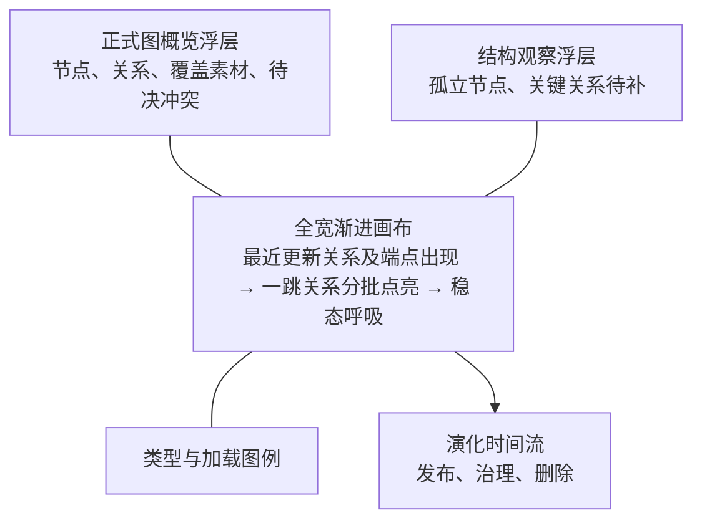
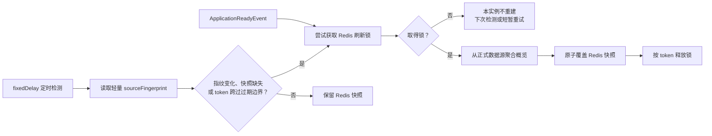

# RUNBOOK: 图谱工作台只读态势图

## Purpose

将 `/knowledge/graph-workbench` 重构为正式发布空间的只读态势图。首屏以渐进生长的大画布展示局部正式图，并展示可重建的统计、结构观察和最近演化。

统计快照不是业务事实，不建立数据库表；它们只作为 Redis 中的运行态派生读模型存在。正式节点、关系、素材映射、发布记录和治理记录仍以现有数据库表为真相源。

## Scope

- `kuzhambu-apps/admin-web`：重构图谱工作台为无操作的全屏态势页和渐进画布。
- `kuzhambu-servers/biz/knowledge`：提供工作台聚合读模型、Redis 快照、启动预热和定时变更检测。
- `db/schema/knowledge.sql`：为两张发布对象-素材关联表补充来源变更时间，作为统计失效检测的业务源字段，不新增统计表。
- `docs/20-interfaces/KNOWLEDGE-GRAPH-INTERFACE.md`：将工作台 HTTP 契约更新为本 RUNBOOK 落地后的实际契约。
- 图谱质量仅显示现有的“孤立节点”和“关键关系待补”两个后端指标。

## Fixed delivery constants

以下数值是本次交付契约，不作为配置项，也不从环境变量读取：

| 常量 | 值 | 含义 |
| --- | --- | --- |
| `RECENT_EDGE_LIMIT` | `200` | 首屏返回的最近更新有效正式关系数 |
| `ONE_HOP_EDGE_BATCH_SIZE` | `50` | 一跳关系的每个后续响应最多返回的边数 |
| `GRAPH_EDGE_LIMIT` | `600` | 前端接纳的去重正式关系总数上限；达到即停止请求 |
| `SNAPSHOT_CHECK_DELAY_MS` | `30_000` | 启动后定时检查快照源指纹的 fixed delay |
| `SNAPSHOT_LOCK_LEASE_MS` | `30_000` | Redis 刷新锁租约 |

节点没有独立数量上限；只能作为已接纳边的 source 或 target 出现。`GRAPH_EDGE_LIMIT=600` 因而自然把画布限制在最多 1,200 个端点节点。任何接口都不得返回或渲染没有至少一条已接纳边的节点。

## Non-goals

- 不在工作台提供筛选、搜索、编辑、发布、撤回、合并、拆分、跳转或任何治理操作。
- 不加载或渲染全量正式图；首屏只展示最近更新的正式关系及其端点节点，并渐进展开一跳局部图。
- 不新增 `knowledge_graph_workbench_stats`、快照历史或任何统计数据库表。
- 不改变素材管理、提取任务、图谱治理和世系图的职责。
- 不把 Redis 快照当作正式业务数据、审计依据或治理命令输入。

## Target Experience



画布首屏高度至少为 `calc(100vh - 页面头部 - 72px)`，桌面端不得置于普通内容卡片内。统计、结构观察和图例以画布上的半透明只读浮层呈现；活动流固定在画布下沿。

### Frontend display contract

| 区域 | 桌面端布局 | 窄屏降级 | 展示字段与规则 |
| --- | --- | --- | --- |
| 页面头部 | 48px 高；左侧标题“知识图谱 · 正式态势”，右侧为 `snapshotAt` | 保留标题和刷新时间，单行截断 | `snapshotAt`；无刷新按钮 |
| 画布 | 占首屏 65%–72%，至少 640px；不使用普通 `Card` 容器 | 高度 480px；统计浮层改为上下两行 | `WorkbenchRecentEdgesResponse.nodes/edges`、`WorkbenchOneHopEdgesResponse.nodes/edges` |
| 顶部统计浮层 | 左上，四个并列数字 | 画布上方的两列静态摘要 | `publishedNodeCount`、`publishedEdgeCount`、`coveredMaterialCount`、`pendingConflictCount` |
| 结构观察浮层 | 左下，两个数字及业务说明 | 统计摘要后两项 | `isolatedNodeCount`、`missingCoreRelationNodeCount`；不请求质量对象列表 |
| 图例 | 右下，节点颜色分组、箭头含义、加载状态 | 画布下方横向换行 | 来自节点 `nodeType`、边 `relationType`、`nextCursor` 和客户端渲染上限 |
| 演化时间流 | 画布下沿，最多 10 条、从新到旧的单行脉冲 | 独立为画布下方列表，最多 5 条 | `recentActivities.type`、`occurredAt`、`summary` |

画布使用页面私有的 `GraphWorkbenchCanvas`（直接基于已安装的 G6），不得为了这个单页面视觉改造共享 `KuzhambuGraph`。它必须禁用节点选择、节点拖拽、详情抽屉和所有业务按钮；不提供工具栏。画布可以自动适配尺寸，但不响应用户的缩放、平移或点击命令。

### Frontend component and view-model contract

页面目录固定为 `src/pages/knowledge/graph-workbench/`，不新增通用组件；这是单页面只读可视化，不适合扩展现有带交互行为的 `KuzhambuGraph`。页面和组件按以下职责拆分：

```text
GraphWorkbenchPage
├── hooks/use-graph-workbench-atlas.ts       // 唯一的请求、游标、取消与批次合并入口
├── graph-workbench-canvas/                  // G6 生命周期和纯画布渲染
├── graph-workbench-overview/                // 统计和结构观察浮层
├── graph-workbench-legend/                  // 类型、加载与局部展示说明
└── graph-workbench-activity-timeline/       // 最近活动的纯展示
```

`GraphWorkbenchPage` 只组合页面、调用 hook 并传递视图模型；不得保存 G6 实例、游标、定时器或接口响应的局部副本。组件目录各自提供 `index.ts` re-export、一个 PascalCase named component 和自己的 CSS；页面根布局只保留在 `graph-workbench-page.css`。

页面内部领域类型定义在 `graph-workbench-types.ts`，HTTP 请求/响应类型只留在 `graph-workbench-service.ts`。展示组件不得接收原始 HTTP 响应、`AbortController`、G6 实例、事件回调或按批数组成的 props。hook 不接收参数，也不向页面暴露重试、分页或取消回调。组件唯一的输入如下：

```ts
type GraphWorkbenchMotion = "full" | "reduced";

interface GraphWorkbenchNode {
  id: string;
  nodeType: string;
  name: string;
  isInitial: boolean;
  degree: number;
}

interface GraphWorkbenchEdge {
  id: string;
  source: string;
  target: string;
  relationType: string;
}

interface GraphWorkbenchActivity {
  type: string;
  occurredAt: string;
  summary: string;
}

interface GraphWorkbenchOverview {
  snapshotAt: string;
  publishedNodeCount: string;
  publishedEdgeCount: string;
  coveredMaterialCount: string;
  pendingConflictCount: string;
  isolatedNodeCount: string;
  missingCoreRelationNodeCount: string;
  recentActivities: readonly GraphWorkbenchActivity[];
}

interface GraphWorkbenchGraph {
  nodes: readonly GraphWorkbenchNode[];
  edges: readonly GraphWorkbenchEdge[];
  loadState: "loading" | "complete" | "capped" | "failed";
  isPartial: boolean;
}

interface GraphWorkbenchEdgeBatch {
  nodes: readonly GraphWorkbenchNode[];
  edges: readonly GraphWorkbenchEdge[];
  nextCursor: string | null;
  truncated: boolean;
}

type GraphWorkbenchOverviewView =
  | { status: "loading" }
  | { status: "unavailable" }
  | { status: "ready"; data: GraphWorkbenchOverview };

interface GraphWorkbenchAtlasViewModel {
  overview: GraphWorkbenchOverviewView;
  graph: GraphWorkbenchGraph;
}

useGraphWorkbenchAtlas(): GraphWorkbenchAtlasViewModel

GraphWorkbenchCanvas({ graph, motion }: {
  graph: GraphWorkbenchGraph;
  motion: GraphWorkbenchMotion;
})
GraphWorkbenchOverview({ overview }: { overview: GraphWorkbenchOverviewView })
GraphWorkbenchLegend({ graph }: { graph: GraphWorkbenchGraph })
GraphWorkbenchActivityTimeline({ activities }: {
  activities: readonly GraphWorkbenchActivity[];
})
```

`graph-workbench-service.ts` 只导出以下三个方法，均返回已转换的页面领域类型；HTTP 的 `*Request` / `*Response` 类型保持文件私有：

```ts
getWorkbenchOverview(): Promise<GraphWorkbenchOverview>
listRecentEdges(): Promise<GraphWorkbenchEdgeBatch>
listOneHopEdges(nodeIds: readonly string[], afterEdgeId?: string): Promise<GraphWorkbenchEdgeBatch>
```

`listRecentEdges()` 返回的 `nextCursor` 固定为 `null`；hook 只从 `listOneHopEdges()` 的返回值读取后续游标。`isInitial=true` 只赋给 `listRecentEdges()` 返回边的端点；后续新增节点为 `false`。每次合并边后重新计算所有已接纳节点的 `degree`，再交给画布决定标签显示。

`GraphWorkbenchOverview` 根据 `overview.status` 渲染固定高度 skeleton、不可用文案或统计浮层；活动流只在 `overview.status="ready"` 时渲染。`GraphWorkbenchPage` 根据 `graph.loadState` 决定画布的加载、完成、局部展示或失败说明。因此概览 Redis 暂不可用不阻断正式图画布，画布请求失败也不隐藏已就绪概览。以上组件均无用户操作 props，确保页面结构本身不重新引入交互能力。

### Frontend file map

| 文件 | 操作 | 唯一职责 |
| --- | --- | --- |
| `kuzhambu-apps/admin-web/src/pages/knowledge/graph-workbench/graph-workbench-page.tsx` | 修改 | 调用 `useGraphWorkbenchAtlas()` 并组合四个展示组件；不保留请求、游标、G6 或动画状态 |
| `kuzhambu-apps/admin-web/src/pages/knowledge/graph-workbench/graph-workbench-page.css` | 修改 | 页面根布局、首屏高度和各浮层之间的布局关系 |
| `kuzhambu-apps/admin-web/src/pages/knowledge/graph-workbench/graph-workbench-types.ts` | 替换 | `GraphWorkbenchNode`、`GraphWorkbenchEdge`、`GraphWorkbenchGraph`、`GraphWorkbenchOverview`、`GraphWorkbenchAtlasViewModel` |
| `kuzhambu-apps/admin-web/src/pages/knowledge/graph-workbench/graph-workbench-service.ts` | 替换 | 三个 HTTP 调用及私有 request/response 类型；响应转换为页面领域类型 |
| `kuzhambu-apps/admin-web/src/pages/knowledge/graph-workbench/hooks/use-graph-workbench-atlas.ts` | 新增 | 唯一的并行请求、游标、去重、边上限、`AbortController` 和动画批次编排入口 |
| `kuzhambu-apps/admin-web/src/pages/knowledge/graph-workbench/graph-workbench-canvas/graph-workbench-canvas.tsx` | 新增 | G6 初始化、数据 diff、自动适配和只读动画；只导出 `GraphWorkbenchCanvas` |
| `kuzhambu-apps/admin-web/src/pages/knowledge/graph-workbench/graph-workbench-overview/graph-workbench-overview.tsx` | 新增 | 概览与结构观察浮层；只导出 `GraphWorkbenchOverview` |
| `kuzhambu-apps/admin-web/src/pages/knowledge/graph-workbench/graph-workbench-legend/graph-workbench-legend.tsx` | 新增 | 类型图例和局部展示状态；只导出 `GraphWorkbenchLegend` |
| `kuzhambu-apps/admin-web/src/pages/knowledge/graph-workbench/graph-workbench-activity-timeline/graph-workbench-activity-timeline.tsx` | 新增 | 最近活动流；只导出 `GraphWorkbenchActivityTimeline` |
| 每个上述组件目录的 `index.ts` 与同名 `.css` | 新增 | `index.ts` 仅 re-export；CSS 只包含本组件内部样式 |
| `kuzhambu-apps/admin-web/src/pages/knowledge/graph-workbench/workbench-canvas/` | 删除 | 删除未接入的模拟批次、节点按钮和选择回调原型 |
| `kuzhambu-apps/admin-web/src/pages/knowledge/graph-workbench/workbench-detail-drawer/` | 删除 | 删除与只读无操作页面冲突的详情抽屉 |

`GraphWorkbenchCanvas` 直接使用 G6，构造时不注册 `drag-canvas`、`zoom-canvas`、`drag-element`、`click-select` 或任何 node/edge click listener；只允许 `resize()` 和程序控制的数据更新。它内部维护 `Graph` 实例与动画队列，销毁时清理两者。

| 视觉元素 | 数据字段 | 固定编码 |
| --- | --- | --- |
| 人物 | `nodeType=PERSON` | 金色 `#D9B35A`，圆形 |
| 地点与建筑 | `PLACE`、`BUILDING` | 青绿 `#4E9E91`，圆角方形 |
| 作品 | `WORK` | 紫色 `#8B78C8`，菱形 |
| 事件与自然现象 | `EVENT`、`NATURAL_PHENOMENON` | 朱砂 `#CF765B`，六边形 |
| 政权、机构与群体 | `DYNASTY`、`ORGANIZATION`、`GROUP` | 靛蓝 `#5A83C8`，圆角方形 |
| 器物、材料、动植物与天体 | `OBJECT`、`MATERIAL`、`ANIMAL`、`PLANT`、`CELESTIAL_BODY` | 土褐 `#9A8662`，圆形 |
| 概念、官职、礼仪与神祇 | `CONCEPT`、`OFFICE`、`RITUAL`、`DEITY` | 莓紫 `#B56D93`，圆形 |
| 未识别类型 | 其他 `nodeType` | 灰蓝 `#718096`，圆形，并在开发期记录告警 |
| 正式关系 | `sourceNodeId`、`targetNodeId`、`relationType` | 低饱和蓝灰线 `#8493A8`，末端箭头指向 `targetNodeId`；默认不绘制关系文字 |
| 节点名称 | `name` | 仅首批关系的端点及当前度数不少于 3 的节点显示，最长 12 个字；其余不显示，避免线团 |

首批最近更新关系及其端点节点采用 0.35 透明度和 12px 尺寸，关系在 420ms 内由透明至可见；这样首批不出现游离节点。后续一跳关系到达后，其端点在 220ms 内升至 1.0 透明度，新增节点为 10px，再在 420ms 内点亮连线；稳态不再变更布局。默认渲染上限为 600 条去重后的边，不设独立节点上限：节点只随已接纳的边出现，最多为 1,200 个端点节点。达到边上限时停止后续请求，在图例显示“已展示局部正式图”，不得将它伪称为加载完成。

每个视觉块还必须有等价文本：统计和结构观察使用正常文本；画布提供 `aria-label`，概述已展示的节点数、边数、是否还有未展示关系，并在画布后提供隐藏的按节点类型汇总文本。`prefers-reduced-motion` 下取消节点出现、边点亮和活动脉冲，仅一次性渲染最终已获取批次。

## Data Ownership and Sources

| 展示数据 | 真相源 | 工作台读取方式 | Redis 规则 |
| --- | --- | --- | --- |
| 正式节点、正式关系、覆盖素材、待决冲突、孤立节点、关键关系待补、最近活动 | 现有正式图、素材映射、发布/治理/删除记录与未消费预览 token | `GraphWorkbenchRepository` 聚合 | 只读 `GraphWorkbenchOverviewSnapshot`；不建表 |
| 最近更新的正式关系及其端点节点 | `knowledge_graph_published_edge` 的现有更新时间排序与正式节点 | 直接读取 `listRecentEdges()`，最多 200 条边及其端点 | 不缓存 |
| 首批关系端点节点的一跳正式关系和关联节点 | `knowledge_graph_published_edge` 与正式节点 | 游标式读取 `listOneHopEdges()`，每批最多 50 条边 | 不缓存 |
| 节点类型、关系类型、来源 | 正式节点/边字段 | 随画布节点和边返回 | 不缓存 |

“关键关系待补”沿用 Schema 中的 `coreRelationPolicy`：一个节点只要有一条入边或出边，且关系类型属于该节点类型规定的 `relationTypes`，即不计入待补。它是质量观察，不是发布拦截条件。

## Runtime Data Structures

### Java read models and ownership

以下是新增或改名后的 Java 领域/应用读模型；业务 ID 始终使用现有强类型 ID，只有 HTTP 边界编码为 `String`。

```java
public record GraphWorkbenchOverviewSnapshot(
        Instant generatedAt,
        String sourceFingerprint,
        long publishedNodeCount,
        long publishedEdgeCount,
        long coveredMaterialCount,
        long isolatedNodeCount,
        long missingCoreRelationNodeCount,
        long pendingConflictCount,
        List<GraphWorkbenchActivity> recentActivities) {}

public record GraphWorkbenchOverviewFingerprint(
        String value,
        Instant nextRefreshAt) {}

public record GraphRecentEdgesResult(
        List<GraphPublishedNode> nodes,
        List<GraphPublishedEdge> edges) {}

public record GraphOneHopEdgesQuery(
        List<GraphPublishedNodeId> nodeIds,
        GraphPublishedEdgeId afterEdgeId) {}

public record GraphOneHopEdgesResult(
        List<GraphPublishedNode> nodes,
        List<GraphPublishedEdge> edges,
        GraphPublishedEdgeId nextCursor,
        boolean truncated) {}

public interface GraphWorkbenchOverviewSource {
    GraphWorkbenchOverviewSnapshot load();
    GraphWorkbenchOverviewFingerprint getFingerprint();
}

public interface GraphWorkbenchSnapshotStore {
    Optional<GraphWorkbenchOverviewSnapshot> get();
    void replace(GraphWorkbenchOverviewSnapshot snapshot);
    Optional<String> tryLock();
    void unlock(String token);
}

public interface GraphWorkbenchSnapshotRefresher {
    void refreshIfRequired(GraphWorkbenchRefreshReason reason);
}

public interface GraphWorkbenchApplicationService {
    GraphWorkbenchOverviewSnapshot getOverview();
    GraphRecentEdgesResult listRecentEdges();
    GraphOneHopEdgesResult listOneHopEdges(GraphOneHopEdgesQuery query);
}
```

`GraphRecentEdgesResult` 的边必须全部为 `ACTIVE`，按 `modified_at DESC, id DESC` 排序，最多 200 条；`nodes` 必须恰好是这些边 source/target 的去重端点。`GraphOneHopEdgesResult.nodes` 必须至少包含其 `edges` 的所有端点，不能返回孤立节点。`truncated=true` 时 `nextCursor` 必须非空；否则这是接口错误。

`tryLock()` 返回空值代表其他实例持锁，调用方直接结束本轮刷新；返回 token 才可 `replace()`，并且只能用同一 token 调用 `unlock()`。`GraphWorkbenchRefreshReason` 只允许 `STARTUP`、`FINGERPRINT_CHANGED`、`CACHE_MISSING`、`TOKEN_EXPIRING` 四个值。`GraphWorkbenchApplicationService.getOverview()` 只能调用 `GraphWorkbenchSnapshotStore.get()`；正式数据聚合只能由 `GraphWorkbenchOverviewSource.load()` 触发。

### Backend file map

| 文件 | 操作 | 责任 |
| --- | --- | --- |
| `kuzhambu-servers/biz/knowledge/kuzhambu-knowledge-domain/src/main/java/com/thundax/kuzhambu/knowledge/domain/graph/model/readmodel/GraphWorkbenchOverviewSnapshot.java` | 新增 | 缓存前的概览不可变读模型 |
| `.../model/readmodel/GraphWorkbenchOverviewFingerprint.java` | 新增 | 指纹值和下一次由 token 过期触发的刷新时间 |
| `kuzhambu-servers/biz/knowledge/kuzhambu-knowledge-application/src/main/java/com/thundax/kuzhambu/knowledge/application/graph/result/GraphRecentEdgesResult.java` | 新增 | 首批最近关系及端点结果 |
| `.../application/graph/query/GraphOneHopEdgesQuery.java` | 新增 | 一跳边的固定端点集合与游标 |
| `.../application/graph/result/GraphOneHopEdgesResult.java` | 新增 | 一跳边批次结果 |
| `.../application/graph/service/GraphWorkbenchOverviewSource.java` | 新增 | `load()` 聚合正式概览，`getFingerprint()` 读取轻量指纹 |
| `.../application/graph/service/GraphWorkbenchSnapshotStore.java` | 新增 | `get()`、`replace(snapshot)`、`tryLock()`、`unlock(token)`；只处理 Redis 快照与锁 |
| `.../application/graph/service/GraphWorkbenchSnapshotRefresher.java` | 新增 | `refreshIfRequired(reason)`：唯一执行指纹判断、加锁、聚合和写快照的应用服务 |
| `.../application/graph/service/GraphWorkbenchRefreshReason.java` | 新增 | `STARTUP`、`FINGERPRINT_CHANGED`、`CACHE_MISSING`、`TOKEN_EXPIRING` 枚举 |
| `.../application/graph/scheduler/GraphWorkbenchSnapshotScheduler.java` | 新增 | `ApplicationReadyEvent` 预热与 `@Scheduled(fixedDelay = 30_000L)`；只调用 refresher |
| `.../application/graph/service/GraphWorkbenchApplicationService.java` | 修改 | `getOverview()`、`listRecentEdges()`、`listOneHopEdges(query)`；删除 `listRecentSeedNodes()`、`listIncidentEdges()` |
| `.../application/graph/service/impl/GraphWorkbenchApplicationServiceImpl.java` | 修改 | 只从 snapshot store 读取 overview；组装 recent/one-hop 画布结果 |
| `.../domain/graph/repository/GraphWorkbenchRepository.java` | 修改 | 增加 `getOverviewFingerprint()` 和 `getOverviewSnapshot()`；不再把实时聚合暴露给 HTTP 调用 |
| `.../domain/graph/repository/GraphPublishedEdgeRepository.java` | 修改 | 增加 `listRecentlyUpdated(int limit)`；`listIncidentEdges` 改名为 `listOneHopEdges` |
| `.../infra/graph/persistence/mapper/GraphWorkbenchMapper.java` | 修改 | 概览聚合和指纹的 SQL |
| `.../infra/graph/persistence/mapper/GraphPublishedEdgeMapper.java` | 修改 | 最近 200 条边及一跳边的 SQL，排序和 `limit + 1` 游标读取 |
| `.../infra/graph/repository/impl/GraphWorkbenchRepositoryImpl.java` | 修改 | 实现 overview snapshot 与 fingerprint |
| `.../infra/graph/repository/impl/GraphPublishedEdgeRepositoryImpl.java` | 修改 | 实现 recent/one-hop 边读取和 `truncated` |
| `.../infra/graph/workbench/GraphWorkbenchOverviewCacheDTO.java` | 新增 | Redis 序列化 DTO；字段与 `GraphWorkbenchOverviewSnapshot` 一一对应 |
| `.../infra/graph/workbench/RedisGraphWorkbenchSnapshotStore.java` | 新增 | JetCache REMOTE 读写和 token 锁实现 |
| `db/schema/knowledge.sql` | 修改 | 两张 `knowledge_graph_published_*_material` 表增加 `changed_at BIGINT NOT NULL` 和 `(changed_at)` 索引；`--rebuild` 重建历史关联、全部关联写路径同步维护 |
| `.../interfaces/admin/graph/GraphController.java` | 修改 | 替换两个画布路由与 handler；保留权限与 `ApiResponse` 包装 |
| `.../interfaces/admin/graph/controller/request/GraphWorkbenchRequests.java` | 修改 | `RecentEdgesListRequest`、`OneHopEdgesListRequest`，删除 Seeds/Incident 请求 |
| `.../interfaces/admin/graph/controller/response/GraphWorkbenchResponses.java` | 修改 | `OverviewData` 增加 `snapshotAt`；新增 `RecentEdgesData`、`OneHopEdgesData` |
| `.../interfaces/admin/graph/assembler/GraphInterfaceAssembler.java` | 修改 | request → `GraphOneHopEdgesQuery` 与结果 → HTTP response 映射 |

表中以 `.../` 开头的路径继承同一工程组的 `src/main/java/com/thundax/kuzhambu/knowledge/` 根路径。不存在的文件必须新增，列为“修改”的文件必须在原位置演进，禁止另起平行工作台模块。

### Test file map

| 文件 | 必须覆盖的契约 |
| --- | --- |
| `kuzhambu-servers/biz/knowledge/kuzhambu-knowledge-interface/src/test/java/com/thundax/kuzhambu/knowledge/interfaces/admin/graph/GraphControllerTest.java` | 三个新路由、权限、`snapshotAt`、200 条 recent 边和 one-hop 50 条固定批次 |
| `kuzhambu-servers/biz/knowledge/kuzhambu-knowledge-interface/src/test/java/com/thundax/kuzhambu/knowledge/interfaces/admin/graph/controller/request/GraphRequestsTest.java` | `OneHopEdgesListRequest.nodeIds` 的非空、数字 ID、最大 400 项和无 `pageSize` |
| `kuzhambu-servers/biz/knowledge/kuzhambu-knowledge-interface/src/test/java/com/thundax/kuzhambu/knowledge/interfaces/admin/graph/controller/response/GraphResponsesTest.java` | `OverviewData.snapshotAt`、`RecentEdgesData`、`OneHopEdgesData.nextCursor/truncated` |
| `kuzhambu-servers/biz/knowledge/kuzhambu-knowledge-infra/src/test/java/com/thundax/kuzhambu/knowledge/infra/graph/repository/impl/GraphWorkbenchRepositoryImplTest.java` | recent 边按 `modified_at DESC, id DESC`、端点去重、fingerprint 及 `changed_at` 变化 |
| `kuzhambu-servers/biz/knowledge/kuzhambu-knowledge-application/src/test/java/com/thundax/kuzhambu/knowledge/application/graph/service/impl/GraphWorkbenchApplicationServiceImplTest.java` | 新增；快照仅读、无快照错误、200/50/600 边规则、锁竞争和旧快照保留 |
| `kuzhambu-apps/admin-web/src/pages/knowledge/graph-workbench/graph-workbench-page.test.tsx` | 四个展示组件的组合、无操作控件、overview 与 graph 状态可独立展示 |
| `kuzhambu-apps/admin-web/e2e/knowledge/graph/graph-mock.fixture.ts` | 新三段接口 mock、两批 50 边游标和 `WORKBENCH_SNAPSHOT_UNAVAILABLE` 场景 |
| `kuzhambu-apps/admin-web/e2e/knowledge/graph/graph.spec.ts` | 首批无游离点、后台追加 50 边、600 边封顶、无点击/拖拽/缩放、窄屏与 reduced motion |

### Redis overview snapshot

新增仅用于远端缓存序列化的 `GraphWorkbenchOverviewCacheDTO implements CacheDTO`。字段采用 Java 与 HTTP 都可稳定表达的类型；所有业务 ID 和 epoch 毫秒在 HTTP 边界仍编码为字符串。

```text
GraphWorkbenchOverviewCacheDTO
  schemaVersion: int                  // 固定为 1；结构变化时递增并换 key
  generatedAt: Instant                // 本次完整重建成功时间
  sourceFingerprint: String           // 参与概览的正式数据指纹
  publishedNodeCount: long
  publishedEdgeCount: long
  coveredMaterialCount: long
  isolatedNodeCount: long
  missingCoreRelationNodeCount: long
  pendingConflictCount: long
  recentActivities: List<ActivityCacheDTO> // 最多 10 条

ActivityCacheDTO
  type: String
  contentType: String | null
  contentRefId: String | null
  occurredAt: Instant
  summary: String
```

缓存名称固定为 `KuzhambuCacheNames.PREFIX + "knowledge.graph.workbench.overview.v1"`，使用 JetCache `CacheType.REMOTE`，禁止 `BOTH`，以免多实例节点各自保留不一致的本地统计。过期、序列化和 Redis 连接策略沿用全局 JetCache 基线；工作台不定义独立 TTL 或刷新提前量。

Redis 另保留一个不包含业务数据的互斥键：`_KUZHAMBU_knowledge.graph.workbench.refresh-lock.v1`。锁租约 30 秒，必须使用原子 `SET NX PX` 语义；持锁实例完成或失败后仅删除自己持有的锁值，禁止无条件删除其他实例的锁。

### 画布响应结构

不缓存画布数据。工作台三段只读接口在本次发布中同步重命名为业务含义明确的路径；这是 admin-web 与 Knowledge server 同一交付单元的受控变更，不保留旧路由别名。必须在同一变更中更新 Controller、request/response 类型、application service 名称、admin-web service、接口文档和接口测试，并删除 `seeds/list`、`incident-edges/list` 及其 `Seeds*`、`IncidentEdges*` 命名。

```text
WorkbenchOverviewResponse
  snapshotAt: string                  // Redis snapshot generatedAt，epoch milliseconds
  publishedNodeCount: string
  publishedEdgeCount: string
  coveredMaterialCount: string
  isolatedNodeCount: string
  missingCoreRelationNodeCount: string
  pendingConflictCount: string
  recentActivities: ActivityData[]

WorkbenchRecentEdgesResponse
  nodes: PublishedNodeData[]          // edges 的去重 source/target；不含额外节点
  edges: PublishedEdgeData[]          // 最多 200 条，按 modifiedAt DESC, id DESC

WorkbenchOneHopEdgesResponse
  nodes: PublishedNodeData[]
  edges: PublishedEdgeData[]
  nextCursor: string | null
  truncated: boolean
```

HTTP 所用的 `PublishedNodeData` 与 `PublishedEdgeData` 复用 `GraphPublishedResponses` 的现有字段；本页只依赖以下字段，均不得为 `null`：

```text
PublishedNodeData { id, nodeType, name }
PublishedEdgeData { id, sourceNodeId, targetNodeId, relationType }
ActivityData { type, occurredAt, summary, contentRef? }
```

`source`、`status`、`lockVersion`、`qualifiers`、`sourceNodeName` 与 `targetNodeName` 可以继续作为兼容字段返回，但前端工作台不得读取它们。工作台没有任何写操作，因此 `lockVersion` 不参与页面领域类型。

overview 快照不存在时不构造半成品响应：接口返回 `WORKBENCH_SNAPSHOT_UNAVAILABLE`。如 Redis 中存在旧快照，则继续返回旧快照及其 `snapshotAt`，刷新过程不暴露为 `refreshState`。前端的加载和不可用状态由 `useGraphWorkbenchAtlas()` 的 `overview.status` 与 `graph.loadState` 表达，避免把基础设施刷新状态扩散为页面协议字段。

`snapshotAt` 仅说明统计生成时间，不承诺画布节点/边与统计在同一数据库瞬间完成快照。工作台是实时态势展示而非审计导出；若未来需要跨接口严格一致性，再单独设计版本化图快照，不能借 Redis 缓存悄然改变正式图读取语义。

## Interfaces

所有 URL 使用 `POST` 和既有 `ApiResponse<T>` 包装。请求类型仅在 `graph-workbench-service.ts` 与 `GraphWorkbenchRequests.java` 中存在，不向 React 组件导出。

```ts
type WorkbenchOverviewResponse = {
  snapshotAt: string;
  publishedNodeCount: string;
  publishedEdgeCount: string;
  coveredMaterialCount: string;
  isolatedNodeCount: string;
  missingCoreRelationNodeCount: string;
  pendingConflictCount: string;
  recentActivities: readonly ActivityData[];
};

type WorkbenchRecentEdgesResponse = {
  nodes: readonly PublishedNodeData[];
  edges: readonly PublishedEdgeData[];
};

type WorkbenchOneHopEdgesRequest = {
  nodeIds: readonly string[]; // 由首批边端点去重而来，1..400 个
  afterEdgeId?: string;
};

type WorkbenchOneHopEdgesResponse = {
  nodes: readonly PublishedNodeData[];
  edges: readonly PublishedEdgeData[];
  nextCursor: string | null;
  truncated: boolean;
};
```

| URL | 请求体 | 响应 | 读取来源与不变量 |
| --- | --- | --- | --- |
| `POST /knowledge/graph/workbench/overview/get` | `{}` | `WorkbenchOverviewResponse` | Redis 快照；无快照返回 `WORKBENCH_SNAPSHOT_UNAVAILABLE` |
| `POST /knowledge/graph/workbench/recent-edges/list` | `{}` | `WorkbenchRecentEdgesResponse` | 正式图数据库；200 条 ACTIVE 边及恰好对应的端点节点 |
| `POST /knowledge/graph/workbench/one-hop-edges/list` | `WorkbenchOneHopEdgesRequest` | `WorkbenchOneHopEdgesResponse` | 正式图数据库；服务端固定最多 50 条边；`truncated=true` 时 `nextCursor` 非空 |

`one-hop-edges` 首批请求省略 `afterEdgeId`；后续请求固定复用由 `recent-edges` 返回的去重端点 `nodeIds`，并传 `afterEdgeId=previousResponse.nextCursor`。`nextCursor=null` 才表示服务端没有下一批。请求中的 `nodeIds` 必须以 `@NotEmpty`、`@Size(max = 400)` 和每项数字 ID 校验；不接受客户端指定 `pageSize`。

所有接口保持 `knowledge:graph:view` 权限、`POST` + JSON body 和既有 `ApiResponse<T>` 包装。工作台前端不得调用全局搜索或质量对象列表接口，因为它们会把纯展示页重新变成查询/待办页。

## Snapshot Build and Refresh

刷新链路必须分开正式数据聚合、Redis 存储和调度编排，避免 `getOverview()` 既读取缓存又被刷新任务当作数据来源调用：

```text
GraphWorkbenchOverviewSource.load()             // 从 GraphWorkbenchRepository 聚合正式数据
GraphWorkbenchOverviewSource.getFingerprint()   // 从 GraphWorkbenchRepository.getByOverviewFingerprint() 读取轻量指纹
GraphWorkbenchSnapshotStore.get() / replace()   // 只读写 Redis 快照
GraphWorkbenchSnapshotRefresher.refreshIfRequired(reason)
                                                   // 指纹、锁、构建和替换的唯一编排处
GraphWorkbenchApplicationService.getOverview()  // 只调用 SnapshotStore.get()
```

`GraphWorkbenchSnapshotRefresher` 依赖 `OverviewSource` 和 `SnapshotStore`，但 `ApplicationService` 不反向依赖 refresher 或 repository。`GraphWorkbenchSnapshotScheduler` 只触发 refresher，不承载 SQL、序列化或 HTTP 映射。



### Source fingerprint

新增 `GraphWorkbenchRepository.getByOverviewFingerprint()`，只读取参与概览的轻量聚合结果，不加载节点、边或活动明细。指纹至少覆盖：

- 有效正式节点和边的数量及最大 `modified_at`；
- `knowledge_graph_published_node_material` 和 `knowledge_graph_published_edge_material` 的数量及最大 `changed_at`；
- 发布记录、治理操作、素材删除变更的最新发生时间及数量；
- 未消费且未过期预览 token 中冲突项的数量；
- 图谱 Schema 的版本或内容摘要，确保核心关系策略变更会刷新统计。

当前两张发布对象-素材关联表没有时间字段，无法用“最大变更时间”检测同数量的关联替换。实施时必须为两表新增非空 `changed_at BIGINT` 及相应索引，并在全部创建、撤回、删除、治理迁移关联的写路径中更新它。这个字段描述正式关联事实的变更时间，不是统计数据；不违反“统计不落数据库”的边界。当前数据库规则要求通过 `scripts/import-seed-data.sh --rebuild` 重建 schema；重建后的历史关联在重建写入时以写入时间填充，禁止新增增量 migration 脚本。禁止以 `COUNT(*)`、`GROUP_CONCAT` 截断摘要或概率散列代替该检测。

预览 token 的过期会在没有写入时改变“待决冲突数”。检测器因此必须把当前时间参与 fingerprint，按最近 token 过期边界计算下一次强制刷新时间；不得只依赖表的更新时间。

### Lifecycle

1. `ApplicationReadyEvent` 异步调用 `refreshIfRequired(STARTUP)`；应用可启动，工作台在快照未就绪时只显示“正式图态势正在准备”。
2. `@Scheduled(fixedDelay = 30_000L)` 读取 fingerprint。
3. 指纹变化、缓存缺失或到达预览 token 的下一过期边界时，尝试刷新。
4. 刷新获得 Redis 分布式锁后，从数据库计算完整概览并写入 Redis；失败时保留仍有效的旧快照，记录 `WARN` 日志和度量。
5. 快照不存在且刷新失败时，overview 接口返回明确的 `WORKBENCH_SNAPSHOT_UNAVAILABLE`；前端显示概览不可用说明，画布仍按自身请求状态展示，不临时把统计 SQL 放到用户请求链路。

运行策略固定在 `GraphWorkbenchSnapshotScheduler`：每 30 秒检测并在需要时重建；Redis 锁只服务于同一重建过程的互斥。缓存生命周期沿用全局 JetCache 基线。工作台不写入 `application.yml`，不提供环境变量开关，也不形成新的运维配置面。

`KuzhambuAdminApplication` 已启用调度；新任务应放在 Knowledge application 的 `graph.scheduler`，不新增第二套调度框架。

## Frontend Progressive Rendering

1. `useGraphWorkbenchAtlas()` 同时请求 overview 和 recent edges；概览浮层采用 skeleton，画布先显示背景与类型图例。overview 返回 `WORKBENCH_SNAPSHOT_UNAVAILABLE` 时，`overview.status` 为 `unavailable`，但不发起统计 SQL 回退，也不取消画布请求。
2. 收到 recent edges 后，先按边 ID 和节点 ID 去重，接纳最多 200 条首批边及其端点节点，`graph.loadState` 保持 `loading`。首批节点和边一起在 300–700ms 内出现，不展示没有关系的节点。
3. hook 从首批边的去重端点取得固定 `nodeIds`，发起首个 `{nodeIds}` one-hop 请求；后续串行请求固定复用该 `nodeIds`，并传 `{nodeIds, afterEdgeId: previousResponse.nextCursor}`。服务端固定每批 50 条。一个加载会话只保留一个 `AbortController`；卸载或新会话开始时取消前一会话，过期会话的响应不得写入 state。
4. 合并边批次时先按 ID 去重节点和边；仅接纳 source 与 target 节点均随本批边返回或已在图中的边，并在不超过 600 条去重边时接纳。节点没有独立上限，只随已接纳边出现，因此画布永不出现游离节点或悬空边。每个已接纳批次以 400–600ms 动画合并：先出现新节点，再点亮连线。
5. 仅当 `nextCursor` 为空时 `graph.loadState` 为 `complete`；`truncated=true` 表示本批之后仍有数据，必须将 `nextCursor` 映射到下一请求的 `afterEdgeId`。达到 600 条去重边时 `graph.loadState` 为 `capped` 并停止请求，在图例显示“已展示局部正式图”。请求失败时 `graph.loadState` 为 `failed`，保留已接纳的局部图和概览。
6. 稳态仅保留低频呼吸与活动时间流脉冲；遵循系统减少动态偏好，`prefers-reduced-motion` 下 `motion="reduced"`，取消入场与持续动画并立即渲染已获取批次。

若 `recent-edges` 返回空 `edges`，hook 设置 `graph.loadState="complete"`，不调用 `one-hop-edges`。若任一 one-hop 响应违反 `truncated=true && nextCursor=null`，hook 将该批视为失败，设置 `graph.loadState="failed"` 并保留前一批已接纳图。`graph.isPartial` 只能在 `loadState` 为 `capped` 或 `failed` 时为 `true`；`loading` 与 `complete` 均为 `false`。

## Implementation Plan

1. 在 `db/schema/knowledge.sql` 为两张发布对象-素材关联表增加 `changed_at` 和索引，并使全部关联写路径维护该字段；通过 `scripts/import-seed-data.sh --rebuild` 重建 schema 与历史关联，不新增增量 migration 脚本。
2. 在 Knowledge application/domain/infra 明确 `GraphWorkbenchOverviewSource`、`GraphWorkbenchSnapshotStore` 与 `GraphWorkbenchSnapshotRefresher` 的窄接口；缓存 DTO 和 JetCache/Redis 实现放在 infra，正式图聚合仍由现有 repository 完成，`ApplicationService.getOverview()` 只读取 store。
3. 为 fingerprint、完整概览聚合、Redis 序列化、锁竞争、旧快照保留和无快照失败分别补单元测试。
4. 新增 `GraphWorkbenchSnapshotScheduler`：`ApplicationReadyEvent` 预热与 fixed-delay 检测复用同一个幂等刷新服务；多实例仅允许一个实例实际重建。
5. 同步重命名工作台画布路由和对应 Controller、request/response、application service：`seeds/list` → `recent-edges/list`、`incident-edges/list` → `one-hop-edges/list`；`recent-edges` 返回 200 条最近更新边及端点，`one-hop-edges` 固定每批 50 条；删除旧路由和旧命名，不保留别名。
6. 调整 `GraphWorkbenchApplicationService.getOverview()` 只读取快照 store，并把 `snapshotAt` 映射到 HTTP 响应；无快照返回 `WORKBENCH_SNAPSHOT_UNAVAILABLE`，不返回 `refreshState`。
7. 更新 admin-web service/types；删除现有三元组筛选表，按“Frontend component and view-model contract”建立页面私有组件和 `useGraphWorkbenchAtlas()`。现有未接入的 `WorkbenchCanvas` 只可复用渐进请求思路，必须删除模拟批次、节点按钮和选择回调。
8. 更新 `KNOWLEDGE-GRAPH-INTERFACE.md`、前端接口契约测试、后端 controller/application/infra 测试和 Playwright 只读态势页冒烟。

## Verification

- Redis 空缓存启动：应用就绪后生成 overview 快照；不创建任何统计数据库表。
- Redis 已有且 fingerprint 未变：定时检测不重建，`generatedAt` 保持不变。
- 正式节点、边、映射、发布/治理/删除记录或 Schema 核心关系策略变化：下一轮检测刷新快照。
- 发布对象-素材关联在数量不变时被替换：两张关联表的 `changed_at` 仍使 fingerprint 变化，并刷新 `coveredMaterialCount`。
- 冲突预览 token 自然过期：不依赖数据库写入也会在到期边界后刷新 `pendingConflictCount`。
- 两个 admin 实例同时检测：只有一个实例执行完整聚合，另一个不覆盖或删除对方的锁。
- Redis 刷新失败：仍有效的旧快照继续返回；无快照时 API 返回确定错误，页面不执行统计 SQL 回退。
- 路由契约验证：旧 `seeds/list`、`incident-edges/list` 不再暴露；新 `recent-edges/list`、`one-hop-edges/list` 与更新后的接口文档、前端 service 和 Controller 一致。
- 画布接口验证：`recent-edges` 最多返回 200 条边及端点，首批不含游离节点；`one-hop-edges` 单批固定 50 条，首批不传 `afterEdgeId`，后续精确传入上一响应的 `nextCursor`；`truncated=true` 且存在 `nextCursor` 时继续请求下一批，只有 `nextCursor=null` 或达到 600 条去重边客户端上限时才停止。
- 前端 hook 验证：新加载或卸载取消旧请求；过期响应不写入 state；节点、边按 ID 去重，节点只随已接纳边出现且不设独立上限；`overview.status` 与 `graph.loadState` 可分别表达概览不可用、画布完成和画布失败。
- 权限验证：无 `knowledge:graph:view` 不读取任何工作台数据。
- 前端验证：首屏没有筛选、查询、重置、编辑、跳转、节点点击、拖拽、缩放或平移控件；`GraphWorkbenchCanvas` 只接收 `{ graph, motion }`，其余展示组件只接收文档声明的只读 props；节点颜色/形状、边箭头、标签密度、窄屏布局和减少动态偏好均符合“Frontend display contract”。

执行时先按触及文件运行最窄格式化，再运行：

```sh
cd kuzhambu-servers
mvn -pl biz/knowledge/kuzhambu-knowledge-application,biz/knowledge/kuzhambu-knowledge-infra,biz/knowledge/kuzhambu-knowledge-interface -am test

cd ../kuzhambu-apps
# 先用 pnpm exec prettier --write 格式化本次触及的 admin-web 文件
pnpm --filter kuzhambu-admin-web run lint
pnpm --filter kuzhambu-admin-web run test
pnpm --filter kuzhambu-admin-web run build
```

## Closure

完成后：

1. 将稳定的 Redis 快照、接口和运行配置结论迁移到 `KNOWLEDGE-GRAPH-INTERFACE.md` 及必要的治理文档；
2. 将启动、定时刷新、多实例锁和降级的验证证据写入 `docs/40-readiness/KNOWLEDGE-GRAPH-WORKBENCH-EVIDENCE.md`；
3. 删除本 RUNBOOK 及其所有引用。
